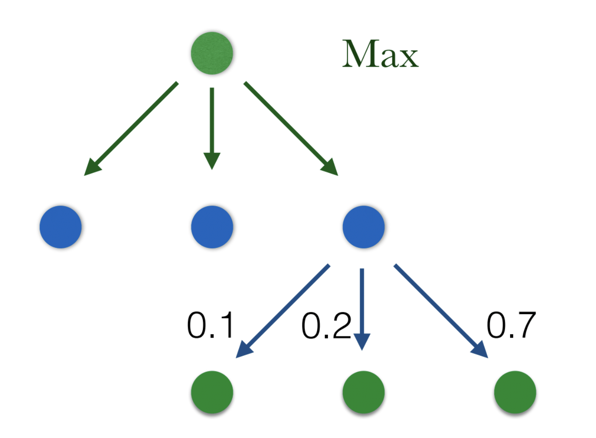
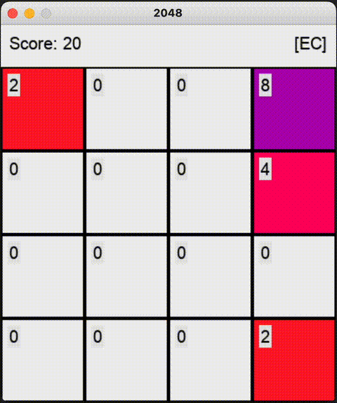
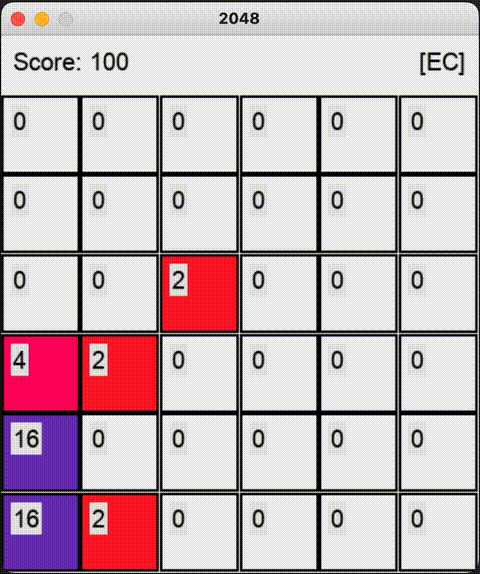
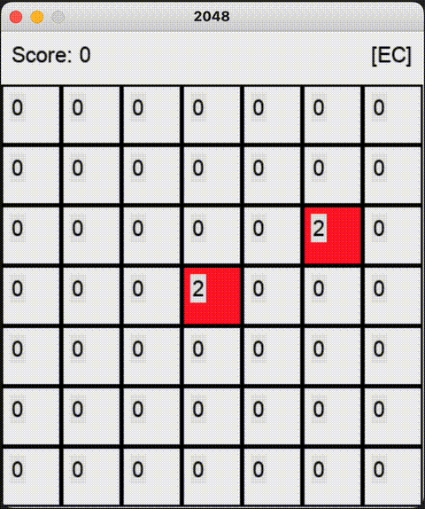

## Introduction
In games like tic-tac-toe and rock-paper-scissors, it is easy to predict what
moves your opponent might make. However, the strategic landscape is
significantly more complex in more complicated games like chess where the
optimal move becomes elusive. The world's top chess players embrace the
complexity of the game and showcase their skills in worldwide competitions,
capturing the attention of millions of spectators. But in 1997, IBM's [Deep
Blue](https://en.wikipedia.org/wiki/Deep_Blue_(chess_computer))
defeated the then world-champion Garry Kasparov.

Despite its intricacies, chess is rooted in the fundamental
principles of a zero-sum game. One player's gain is his opponent's loss. In
game theory, the concept of a minimax tree encapsulates this idea well. By
representing the game in a tree-like structure, where each node represents a
particular state of the game and each edge represents possible moves or actions
by the players. 


As a result, it is easy for a computer to use brute-force
computation to calculate the payoff and probable outcomes of every move. This,
in combination with some optimzation techniques like alpha-beta pruning is lead
Deep Blue's success.

## Expectimax

Expectimax trees are another type of tree used in game theory, specifically for
games iwth uncertainty or randomness involved. While minimax trees are designed 
for two-player zero-sum games, expectimax trees are used for games where the 
outcome is influenced by chance or where one of the players has incomplete 
information.



Now, nodes represent the possible random events that can occur in the game, and
branches stemming from each node represent the probability of corresponding
outcomes. As you'd expect, the pseudocode searches each possible outcome and its
probability:

```python
def expectimax(node):
    if terminal(node):
        return payoff(node)
    elif max_player(node)
        value = -infinity
        for n in children(node):
            value = max(value, expectimax(n))
        return value
    elif chance_player(node):
        value = 0
        for n in children(node):
            value = value + expectimax(n) * chance(n)
        return value
    else:
        error
```
This does not include building the tree itself or how to define payoffs and
other heuristics as will be discussed later.


## 2048
As it turns out, the above code is all you need to create an AI agent to play
the popular phone game 2048. In the case of 2048, the probabilty of an event 
happening is the probability a square will spawn in a given open cell, and 
each child node of a given outcome is a move up, down, left, or right. 

### Heuristics
As a human player, we easily
recognize when two of the same tiles are in the same row or column and make the
appropriate move. How does the algorithm know what move to make? Using the only
the score of the game turns out to be an ineffective agent. When building the
expectimax tree, we can bias this weight using custom heuristics of our own.
Example heuristics value:
- Open spots on the board
    - Intuition: The game ends when the board fills up. If we favor having 
      more empty spots for tiles to spawn, we can continue gathering points.
- The ability for tiles to be merged
    - Intuition: Again, consolidating space through tile merging can extend the
      length of the game and number of points that can be gathered.
- Large tiles on the edges
    - Intuition: Newly spawned tiles are never large tiles. Thus, the number of
      adjacent tiles to large tiles should be minimized because large tiles can
      never be merged with small tiles and would end up wasting board space.

There of course exists more heuristics to consider, but these are a good
starting point.

### Computation
Together,
this information allows the algorithm will search for the best move. In the 
case of this project, we limit
the depth of the tree to be three, as building and exploring a tree deeper than
that is computationally expensive.

Here we can see some examples of the expectimax agent in action:






Notice how on smaller boards the expectimax agent runs noticeably faster,
gathering points more easily. As previously mentioned, this is due to the number
of probable outcomes and actions calculated by the tree. Consider the 4x4 game
board. In each iteration of the tree, we see 4 possible moves followed by 
4 x 4 = 16 possible locations where a new square can spawn (although squares
will be occupied decreasing this number over time). As a result, over three
iterations of the tree, we have approximately
$$ 4^3(4^2)^3 = 262,144 \text{ nodes} $$
Using similar logic, we have
$$ 4^3(5^2)^3 \approx 1,000,000 \text{ nodes} $$
$$ 4^3(6^2)^3 \approx 3,000,000 \text{ nodes} $$
$$ 4^3(7^2)^3 \approx 7,500,000 \text{ nodes} $$
For the 5x5, 6x6, and 7x7 boards respectively.

### Optimization
Evidently, the number of computations grows exponentially by scaling board size
and tree depth. One optimization technique includes [alpha-beta pruning](https://en.wikipedia.org/wiki/Alpha–beta_pruning).
In short, alpha-beta pruning is a technique to "prune" useless computations by
keeping track of values "alpha" and "beta". In a traditional minimax tree, alpha
and beta are either minimized or maximized by the max player or min player to
avoid calculating bad moves. In chess, this might be avoiding the calculation of
blunders. 

However in our case, we can adapt alpha and beta to keep track of the
best and worst expected values encountered so far (i.e. we only consider nodes
that have the best chance of improving our score. At an action node, if the best
value is less than or equal to the worst value encountered so far, we can safely
"prune" its remaining branches. This allows us to improve the efficiency of the
search algorithm and as a result, search deeper into the tree.

## Conclusion
After
Garry Kasparov's loss to Deep Blue, the Chinese game of [Go](https://en.wikipedia.org/wiki/Go_(game))
became the canonical example of a game where humans outmatched machines. Go
requires more intuition and is far less susceptible to brute force algorithms
like expectimax. However 18 years later, the top-ranked Go player 
[Lee Sedol](https://en.wikipedia.org/wiki/Lee_Sedol) was defeated by Google
DeepMind's [AlphaGo](https://en.wikipedia.org/wiki/AlphaGo) using a different
yet similar algorithm, Monte Carlo tree search along with deep neural networks.
Today, artificial intelligence is continually pushing the boundaries of what
machines can do.

The core content of this article is based on a programming assignment by
professor [Gao Sicun](https://jacobsschool.ucsd.edu/node/3603) for his class
CSE150B, Introduction to AI: Search and Reasoning.
