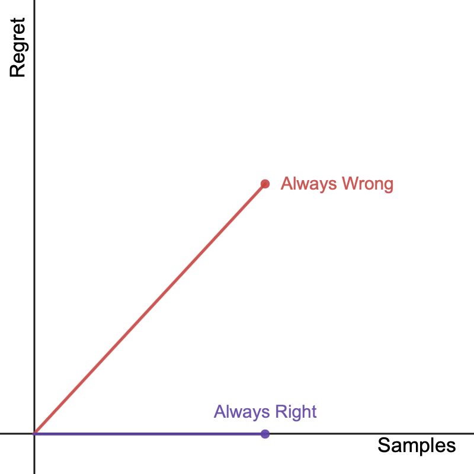
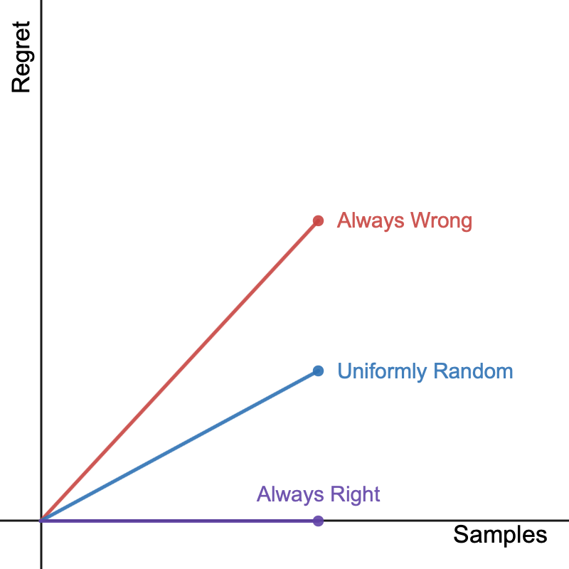
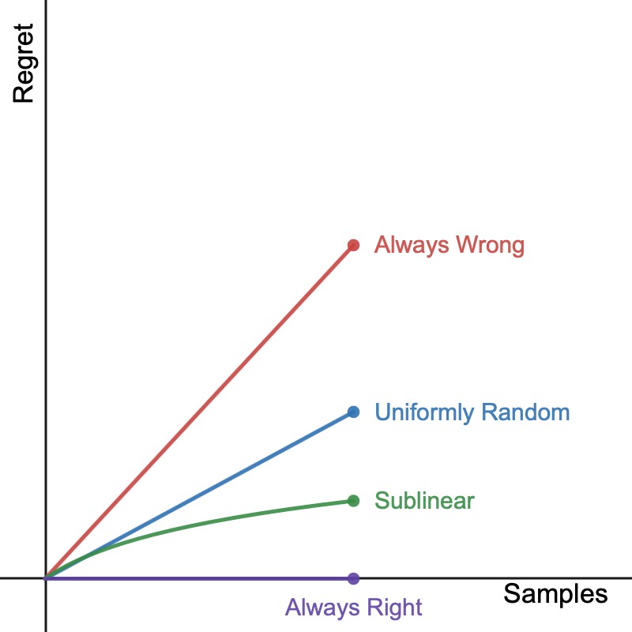

## Introduction
Before we get can program the AI agent, let's briefly touch on the math
that will dictate how this AI agent will make its decisions: Monte Carlo
Methods and Multi-Armed Bandits (Which will later all be put together in a
search tree).

## Monte Carlo Methods
Monte Carlo methods are a class of algorithms that use random sampling to obtain
numerical results for various kinds of problems.
Named after the famous Monte Carlo Casino in Monaco, Monte Carlo Methods 
are a class of algorithms that use random sampling to obtain numerical 
results for various kinds of problems.

Here's a neat application of Monte Carlo methods in action:



We can estimate $\pi$ by simply counting the number of random samples that land
inside the circle divided by the number of random samples that land outside the
circle.

$$ 4 \cdot \frac{N_{inner}}{N_{total}} \rightarrow \pi $$

More generally, we can write:

$$\frac{1}{n} \sum_{i = 1}^n X_i \rightarrow E(X)$$

Clearly, as the number of samples increases, the better our approximation of our
numerical result will be. But in reality, we do not have access to infinite
random samples or data points to approximate a problem. Thus, we must strike a
balance between exploration and exploitation.

## Multi-Armed Bandits

Exploration versus exploitation is a classic problem in probability theory,
summarized as: 
[Multi-Armed Bandits](https://en.wikipedia.org/wiki/Multi-armed_bandit). 
The name is derived from a metaphor involving a gambler playing a row
of slot machines (also known as "one-armed bandits"). 

In this problem, we are faced with $N$ different slot machines, each with its
own unknown probability distribution for payout. We are tasked with figuring out
which machine to play at each turn in order to maximize our prize pool over a
given number of turns. Thus, we want to first "explore" our options then
"exploit" the best option we have seen so far. This can also be considered a
real-world approach to applying Monte Carlo methods.

This video gives a simple example of what Multi-Armed Bandits are:



Two algorithms that have been developed to solve multi-armed bandit problems
include the Epsilon-Greedy and Upper Confidence Bound (UCB) algorithms, both of
which our algorithm depends on.

### Regret

Let's define regret over time (of a specific strategy) $\sigma$ to as the
expected loss over time compared to the best possible outcome of our game. This
looks something like:

$$ R_{\sigma}(t) = \mathbb{E}(\sum_{i = 0}^tX_{c^*} - \sum_{i = 0}^tX_{c_i})$$

This can be read as "the average of the optimal
choice minus my choice over the history of our game." 

Let's consider a game where we must guess
whether or not a coin lands heads or tails. We don't know if the coin is
weighted or not, and we are simply tasked with coming up with the best strategy
of picking heads or tails prior to each flip. Therefore, our regret would be the
number of times we guessed the coin incorrectly for $t$ total trials.

Now consider a plot of the
number of samples over time versus our running regret:

The purple line represents the case where our choice is completely correct. The
regret is always zero because we always correctly guess the outcome. 
The red line represents when our choices are always wrong. The
regret grows as quickly as it can (linear growth) because we make an incorrect 
guess for every sample.

But in reality, it would be near impossible to make an incorrect guess every
single time. Consider the blue line, where we make uniformly random guesses. The
regret grows half as quickly as it does in the case where we are completely
wrong as on average, we will get 50% correctly and 50% incorrectly.

What we want to achieve with our is the green line, our sublinear regret. The
intial increase in regret will be due to an "exploration" process where we test
out a few samples. Then once we get a good idea of how the game works based on
the samples we've seen, we expect minimal wrong cases (or increase in regret).

### Epsilon-Greedy
To achieve sublinear regret, consider the epsilon greedy method. Simply put, for
any round $t$, we compare the average reward of our choices and choose the one
with better empirical mean with probability of $1 - \epsilon$ and make a random
choice with probability $\epsilon$. Generally, $\epsilon$ is a small value.
Therefore, we will make the best choice we've seen so far a majority of the
time, while sometimes making new choices (to get new datapoints).

Without going into too much detail, by choosing an epsilon $\epsilon =
\sqrt{\frac{c\log T}{N}}$, where $N$ represents the number of independent and
identically distributed samples and $c$ is a variable to help us fine-tune
epsilon. This is based on 
[Hoeffding's Inequality](https://en.wikipedia.org/wiki/Hoeffding's_inequality).

In general, this helps the epsilon-greedy method achieve a regret of
$$ \mathbb{E}[R_{\sigma}(N)] \approx O(N^{\frac{2}{3}}(K \log N)^{\frac{1}{3}})$$
which is sublinear! 🎉

### Upper Confidence Bound (UCB)

But we can do better. Notice how in the epsilon-greedy method, we are always
guaranteed a probability $\epsilon$ to make a random (likely suboptimal) 
choice. UCB or Upper Confidence Bound will help us solve this exact issue. We
will adapt our plays based on actual performance. In this way, we can further
decrease our regret.

