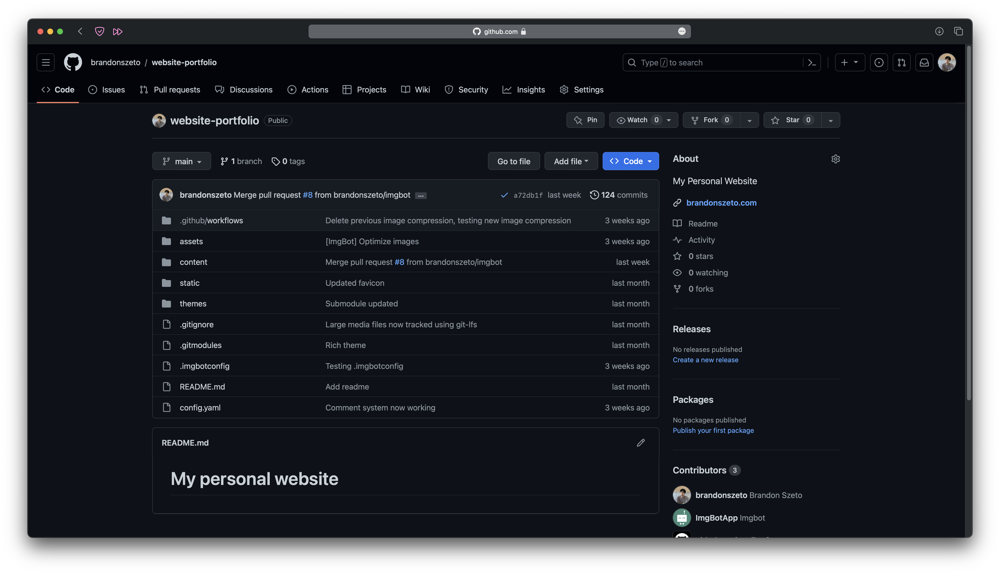

## Introduction

Building a personal website has never been easier thanks to the many widely
accessible tools that exist today! In this post, I'll walk through my experience
setting up this website using Hugo and deploying it on GitHub Pages.
To those familiar with GitHub, a website on GitHub Pages leverages the
GitHub platform to create a seamless experience from building to deploying your
site.

*This blog also exists for my own reference when I inevitably forget how I did
something 6 months from now.*

## GitHub Pages

GitHub pages is a static site hosting service that allows the deployment of a
website directly from a GitHub repository. This makes it well-suited for
to host static websites like blogs, portfolios, and project documentation.

The basic idea is that you create a repository on GitHub, push the website files
to a designated branch of that repository, and GitHub Pages will serve those
files as a website. By default, GitHub uses Jekyll to generate your static site.
However, you can also use other static site generators or simply plain HTML,
CSS, and JavaScript. In my case, I used Hugo (more on that later).

Lastly, GitHub Pages is completely free and will host your website on a 
.github.io subdomain for free! The only caveat is that GitHub pages is designed
for static content, meaning that no server-side applications can be run. There
are also some limitations on bandwidth (100GB per month per repository), memory
usage (1 GB per repository), and CPU usage (if limit is exceeded, your site may
be throttled to ensure fair usage of shared resources).

I've also tried
[Netlify](https://www.netlify.com)
and
[Vercel](https://www.vercel.com), 
but in my experience, they don't offer much advantage over GitHub Pages when it
comes to hosting a static site. Additionally, using a third party hosting
platform only complicates the process, especially since they both rely on Git
for pushing updates. 

The official GitHub docs:
- [Creating a GitHub Pages Site (Quickstart)](https://docs.github.com/en/pages/getting-started-with-github-pages/creating-a-github-pages-site)
- [Official GitHub Pages Docs](https://docs.github.com/en/pages/getting-started-with-github-pages/about-github-pages)

[Link to my website repo](https://github.com/brandonszeto/website-portfolio)

## Custom Domain

### Setting up a Custom Domain on GitHub

## Hugo Template

## Conclusion
