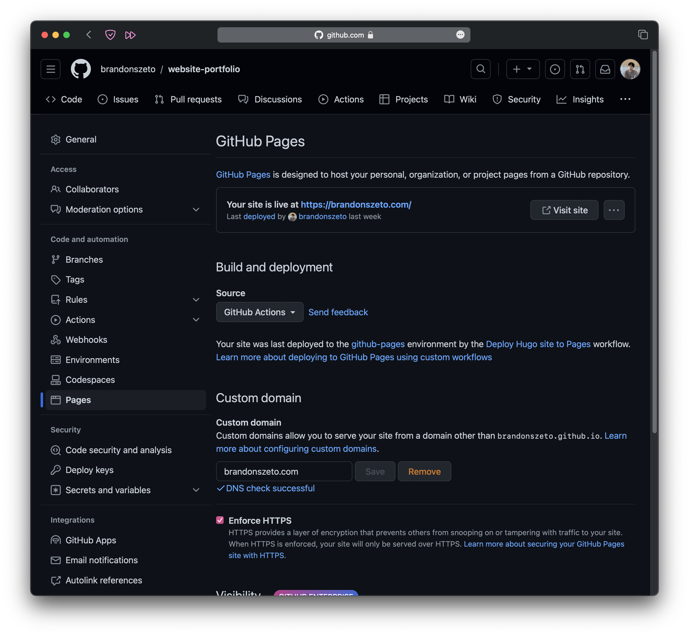
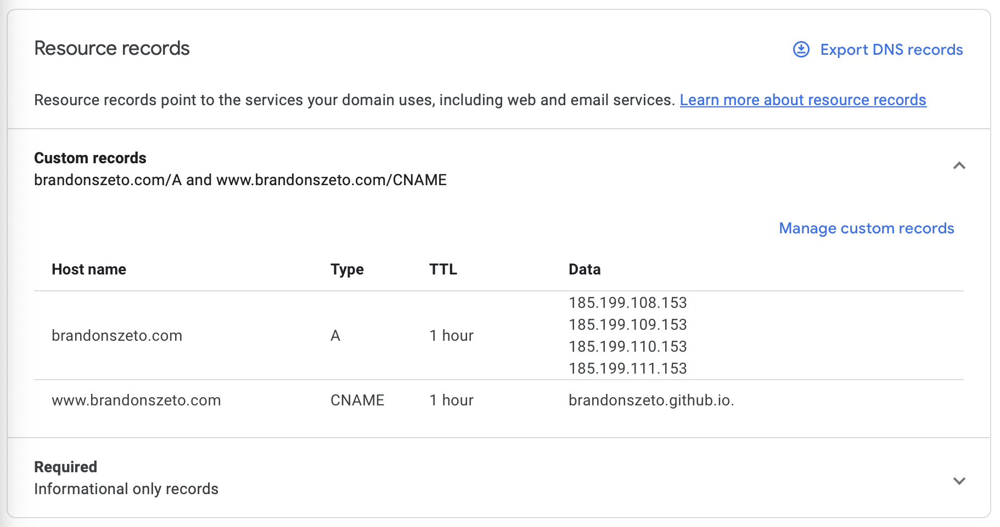
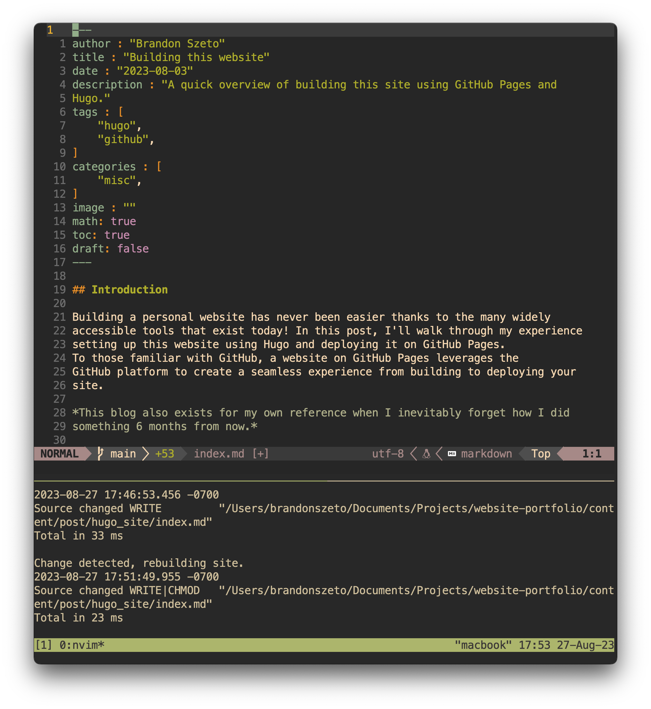
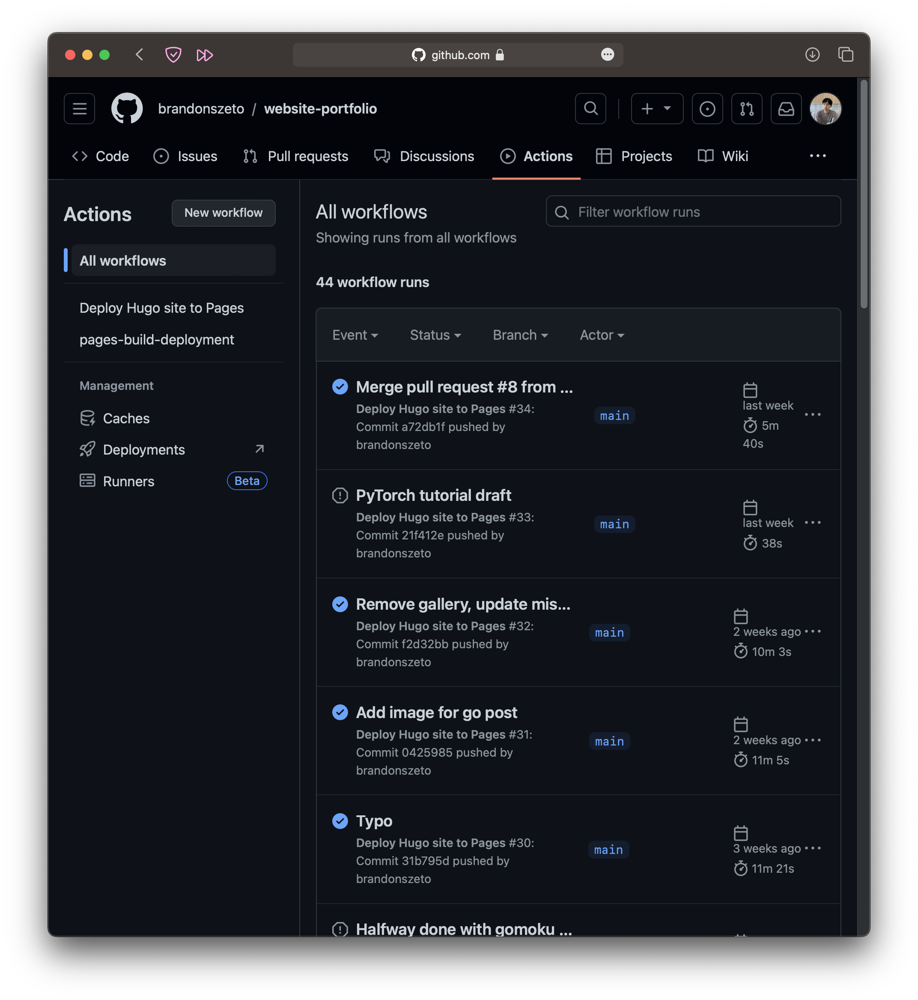
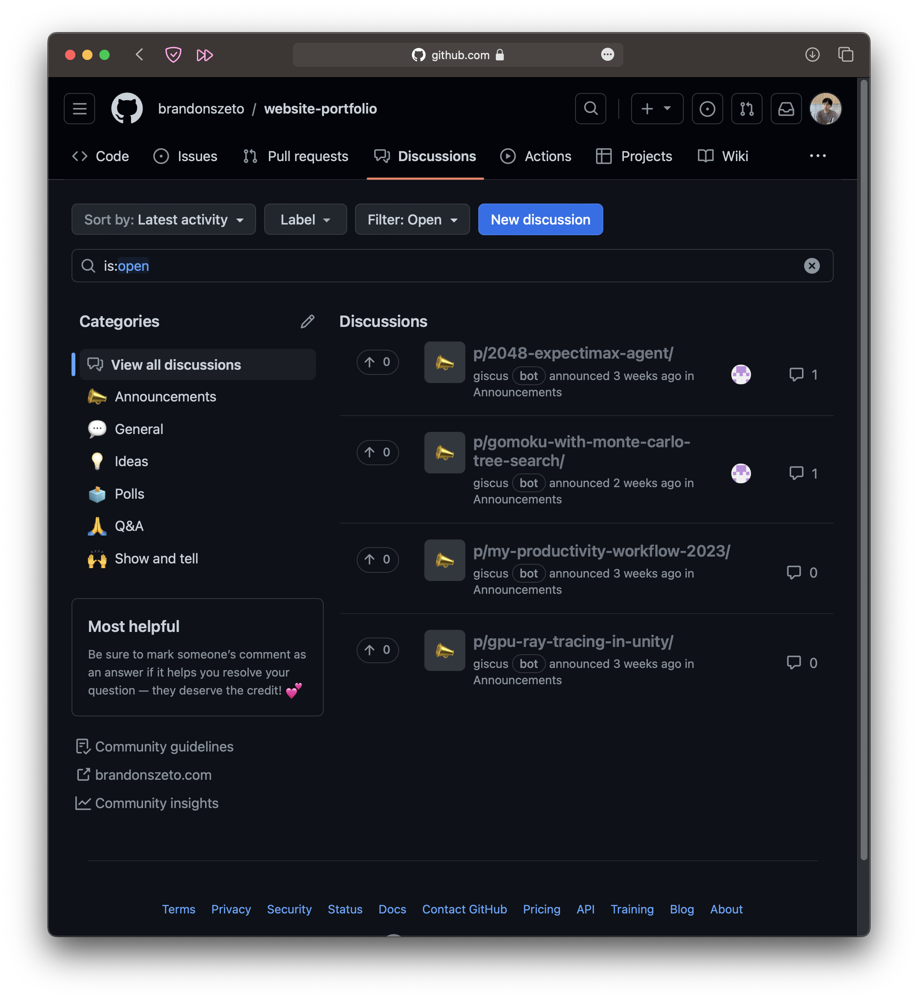
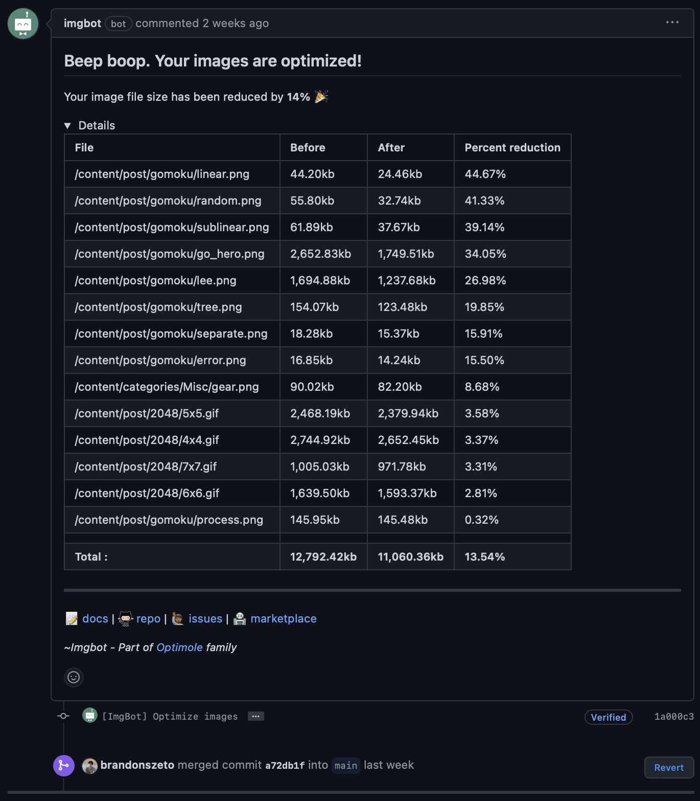

## Introduction

Building a personal website has never been easier thanks to the many widely
accessible tools that exist today! In this post, I'll walk through my experience
setting up this website using Hugo and deploying it on GitHub Pages.
To those familiar with GitHub, a website on GitHub Pages leverages the
GitHub platform to create a seamless experience from building to deploying your
site.

*This blog also exists for my own reference when I inevitably forget how I did
something 6 months from now. It also seems like the first thing new Hugo users
write about in their blog.*

## GitHub Pages

GitHub pages is a static site hosting service that allows the deployment of a
website directly from a GitHub repository. This makes it well-suited for
to host static websites like blogs, portfolios, and project documentation.

The basic idea is that you create a repository on GitHub, push the website files
to a designated branch of that repository, and GitHub Pages will serve those
files as a website. By default, GitHub uses Jekyll to generate your static site.
However, you can also use other static site generators or simply plain HTML,
CSS, and JavaScript. In my case, I used Hugo (more on that later).

Lastly, GitHub Pages is completely free and will host your website on a 
.github.io subdomain for free! The only caveat is that GitHub pages is designed
for static content, meaning that no server-side applications can be run. There
are also some limitations on bandwidth (100GB per month per repository), memory
usage (1 GB per repository), and CPU usage (if limit is exceeded, your site may
be throttled to ensure fair usage of shared resources).

I've also tried
[Netlify](https://www.netlify.com)
and
[Vercel](https://www.vercel.com), 
but in my experience, they don't offer much advantage over GitHub Pages when it
comes to hosting a static site. Additionally, using a third party hosting
platform only complicates the process, especially since they both rely on Git
for pushing updates. 

The official GitHub docs:
- [Creating a GitHub Pages Site (Quickstart)](https://docs.github.com/en/pages/getting-started-with-github-pages/creating-a-github-pages-site)
- [Official GitHub Pages Docs](https://docs.github.com/en/pages/getting-started-with-github-pages/about-github-pages)

A static site hosted on GitHub pages should look something like the following:


If you want to check out my website repository check [here](https://github.com/brandonszeto/website-portfolio).

## Custom Domain
As you may have noticed, my domain does not end in .github.io. Instead, I am
serving my blog from a custom domain. The process is simple and affordable if
you want to go the extra step to obtain a custom domain. In my case,
brandonszeto.com cost me $12/year from Google Domains. However, prices may vary
dramatically depending on the domain name you want. For example, the most
expensive domain name ever sold was cars.com for $872 million according to
GoDaddy.

The process is extremely simple. First, you want to go to your repository
settings and fine the pages settings. Here, you can simply type your custom
domain.



Here, you will also have the choice to enforce HTTPS encryption. Next, you go to
Google Domains (or your DNS provider of choice) and create a `CNAME` record that
points your subdomain to the default domain of your site. In my case this is
`brandonszeto.github.io`. Next, an `A` record can be created by pointing the
apex domain to the IP addresses for GitHub Pages. Below, you can see what this
looks like in Google Domains:



*Note: There are four IP addresses in the A record to help with load balancing.*

## Hugo

[Hugo](https://gohugo.io) is one of the most popular static site generators,
known for its speed and flexibility. It simplifies the task of creating a site
from building plain HTML, CSS, and JavaScript files by generating a website from
a set of markdown files and one configuration file (I've gotten overly ambitious
and tried writing my own site from scratch, and it's not worth the headache of
writing HTML, CSS, and JavaScript when someone has already done a much better
job). Paired with the wide range
of themes and plugins made by the Hugo community, it is fast and easy to get
your own personal website setup.

### Prerequisites
To get started with Hugo, you need to have installed [Hugo](https://gohugo.io/installation/)
and [Git](https://git-scm.com/book/en/v2/Getting-Started-Installing-Git). This
will give you access to the Hugo and Git CLI tools.

### Overview
Here is an overview of the information I believe to be the most important.

- `hugo new site example` will create a directory with the following file
  structure:

```python
example/
├── archetypes/
│   └── default.md
├── assets/
├── content/
├── data/
├── layouts/
├── public/
├── static/
├── themes/
└── hugo.toml
```

- We can turn this into a git repository by running `git init` inside the
  respository.
- Each of these directories will hold specific parts of your site. For more information
  on this, see [here](https://gohugo.io/getting-started/directory-structure/).
- `themes` will host a git submodule referring to your theme of choice.
- `content` will host your markdown files that you want to serve on your site.
- `hugo.toml` is your configuration settings for your site. This is sometimes
  seen as `config.yaml` or `config.json`.

### Themes

A list of themes made by the community can be found [here](https://themes.gohugo.io).
You of course have the option to create your own theme, but plenty of great
themes already exist. Just be sure to choose a theme that is actively
maintained! In my case, changes I wanted to make to my theme wasn't promptly
reviewed by the repository owner, so I ended up cloning the project and making
changes on a fork. I then used my fork of the project as the git submodule under
the `themes/` directory.

### Content

Hugo makes content generation extremely easy by serving markdown files formatted
using your custom theme. Every piece of content will look like the following:



At the top of the markdown file, we have frontmatter between the two `---`
delimiters. This dictates the settings for a given piece of content. This
differs between each theme, so be sure to look at the theme documentation for
your choice of theme.

The rest of the file is written in plain markdown with specific features added
from your theme. For example, the theme I chose features the use of LaTeX
typesetting using the `$` delimiters.

### Configuration
As previously mentioned, site-wide configuration is made in a config file. Hugo
supports the `json`, `toml`, and `yaml` data serialization formats for your
config file. Again, this file differs from theme-to-theme depending on what
features and settings the theme author implemented. Thus, be sure to look at
your theme documentation when configuring your site. For reference, the
site-wide configurations available for the my website can be found here at [stack.jimmycai.com](https://stack.jimmycai.com/config/site).

### Development

Hugo offers a development server to view the site and local changes made
to your site in real time. This can be done by running:
- `hugo server` in the current directory.
This automatically serves your static site to `localhost:1313` if the port is
not in use. If it is in use, you can hugo will let you know the port your site
is being served in the command line.

More details on the options and flags for this command can be found [here](https://gohugo.io/commands/hugo_server/).
In fact, everything you will need to know about Hugo can be found in the [Hugo
documentation](https://gohugo.io/documentation/).

### Deploy to GitHub Pages

Lastly, to deploy your site to GitHub Pages, we need to set our build and
deployment source to `GitHub Actions` in the `Settings>Pages` section of your
repository.


Next, you'll want to create a new GitHub workflows with the following
configuration:

```python
# Sample workflow for building and deploying a Hugo site to GitHub Pages
name: Deploy Hugo site to Pages

on:
  # Runs on pushes targeting the default branch
  push:
    branches:
      - main

  # Allows you to run this workflow manually from the Actions tab
  workflow_dispatch:

# Sets permissions of the GITHUB_TOKEN to allow deployment to GitHub Pages
permissions:
  contents: read
  pages: write
  id-token: write

# Allow only one concurrent deployment, skipping runs queued between the run in-progress and latest queued.
# However, do NOT cancel in-progress runs as we want to allow these production deployments to complete.
concurrency:
  group: "pages"
  cancel-in-progress: false

# Default to bash
defaults:
  run:
    shell: bash

jobs:
  # Build job
  build:
    runs-on: ubuntu-latest
    env:
      HUGO_VERSION: 0.115.4
    steps:
      - name: Install Hugo CLI
        run: |
          wget -O ${{ runner.temp }}/hugo.deb https://github.com/gohugoio/hugo/releases/download/v${HUGO_VERSION}/hugo_extended_${HUGO_VERSION}_linux-amd64.deb \
          && sudo dpkg -i ${{ runner.temp }}/hugo.deb          
      - name: Install Dart Sass
        run: sudo snap install dart-sass
      - name: Checkout
        uses: actions/checkout@v3
        with:
          submodules: recursive
          fetch-depth: 0
      - name: Setup Pages
        id: pages
        uses: actions/configure-pages@v3
      - name: Install Node.js dependencies
        run: "[[ -f package-lock.json || -f npm-shrinkwrap.json ]] && npm ci || true"
      - name: Build with Hugo
        env:
          # For maximum backward compatibility with Hugo modules
          HUGO_ENVIRONMENT: production
          HUGO_ENV: production
        run: |
          hugo \
            --gc \
            --minify \
            --baseURL "${{ steps.pages.outputs.base_url }}/"          
      - name: Upload artifact
        uses: actions/upload-pages-artifact@v1
        with:
          path: ./public

  # Deployment job
  deploy:
    environment:
      name: github-pages
      url: ${{ steps.deployment.outputs.page_url }}
    runs-on: ubuntu-latest
    needs: build
    steps:
      - name: Deploy to GitHub Pages
        id: deployment
        uses: actions/deploy-pages@v2
```

Finally, your site will be deployed on every push. After a couple of pushes,
this will look something like (under `Actions` tab):



Remember to make sure that your repository is **public**. If not, you could run
into limits imposed by GitHub on private repositories!

## Extras

Some nice, but not necessary things I've added to my site include `giscus`, a
comment system powered by GitHub Discussions and `Imgbot`, a bot that
automatically optimizes all images in a GitHub repository.

### Giscus
[Giscus](https://giscus.app)
is one of many comment APIs that can be used in your blog. However,
Giscus takes advantage of GitHub Discussions, letting visitors to your site
leave comments and reactions on your site via GitHub. You will just need to make
sure that your theme supports Giscus or your choice of comment system.
Integrating a comment system should be as easy as changing a site-wide
configuration setting in your `hugo.toml` file and making sure your site is
public. Altogether, new comments on your site will be found under the
`Discussions` tab on GitHub:



### Imgbot

[Imgbot](https://imgbot.net)
is a reliable bot that checks whether your images in a repository are
optimized or not, and automatically submits a pull request when it notices
optimizations to be made. All compressions it proposes are lossless by default,
but you can change this setting in a file named `.imgbotconfig` at the root of
your directory if compression is very important to you. Documentation on
configuration can be found [here](https://imgbot.net/docs/).

In the end, a successful pull request should be made that looks something like:



*I had an issue where imgbot would not submit pull requests. This was solved by
setting "minKBReduced" to 0.*

## Conclusion
Setting up your website is only the beginnning. Most of your effort will be
going towards creating content for your site, whether it is interesting and gets
attention or not. However, following these steps, you can create a functional 
website to post content of your own. The key step is to get started. 

### Resources
- [Git](https://git-scm.com)
- [GitHub Pages Documentation](https://docs.github.com/pages)
- [GitHub Discussions Documentation](https://docs.github.com/en/discussions)
- [Giscus](https://giscus.app)
- [GitHub Actions Documentation](https://docs.github.com/en/actions)

- [Hugo](https://gohugo.io)
- [Hugo Documentation](https://gohugo.io/documentation/)

- [Imgbot](https://imgbot.net)
- [Imgbot Documentation](https://imgbot.net/docs/)

- [Hugo Stack Theme]()
- [Hugo Stack Theme Documentation]()
