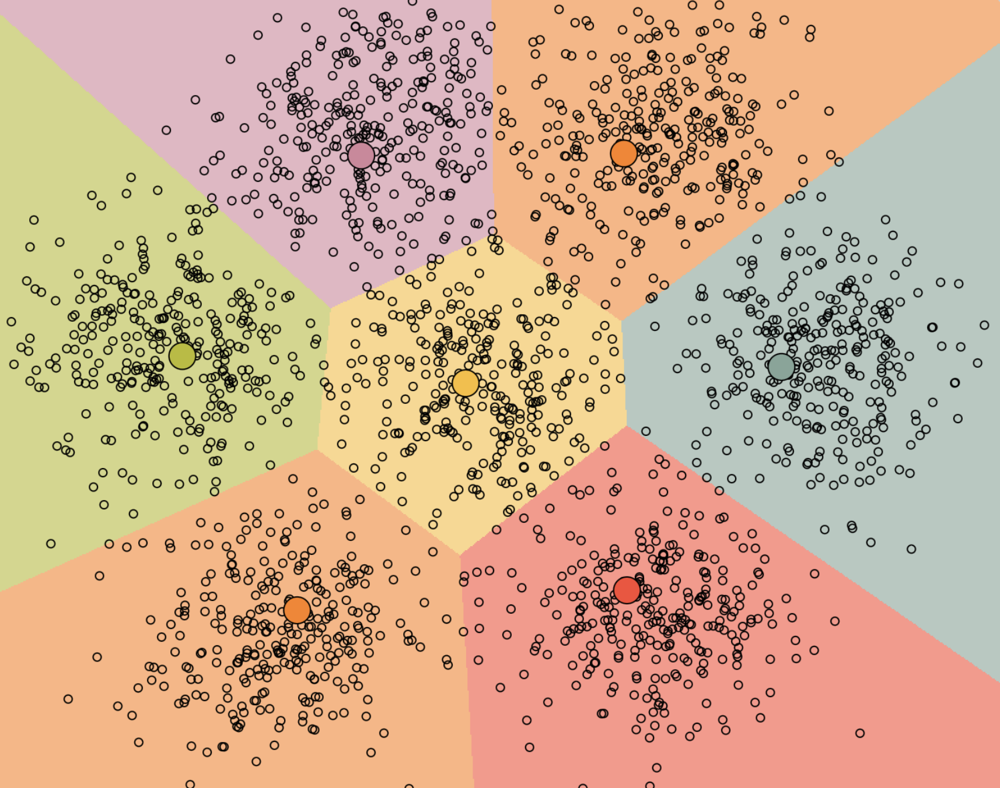

## Lloyd's (naïve K-Means) Algorithm
The goal of the k-means is to partition a dataset into $k$ clusters of data, hence
the name _k-means_. The algorithm iterates between two steps: 
1. Data points are assigned to the nearest centroid
2. Centroids are updated based on the previous assignments.

Seeing the algorithm in action quickly builds intuition. Below I've created an 
interactive demo to run the k-means algorithm yourself. 

## Interactive Demo (Click to draw)



> `Run` runs the algoirthm after data and centroids have been drawn.
>
> `Clear` clears the screen and resets the data.
>
> `Draw Centroids` toggles centroid drawing mode.
>
> `Draw Point` toggles single point drawing mode.
>
> `Draw Cluster` toggles point cloud drawing mode. The number of points can
  be adjusted in the number input. The standard deviation can be adjusted by the
  slider.

### Example Usage
First, I created some data points by drawing 8 clusters in a hexagonal pattern, and drawing 8 centroids in random locations. I then clicked run multiple times until the centroids did not move when pressing run. The final result is a partition of the datapoints into "buckets" of datapoints corresponding to each centroid. This can be seen in the below image:

### Formal Definition
More formally, given a set of observations $(\mathbf{x}_1, \mathbf{x}_2, \cdots, \mathbf{x}_n) \in \mathbb{R}^d$, the algorithm aims to partition the observations into $k \leq n$ sets $\mathbf{S} = ( S_1, S_2, \cdots, S_k )$ in order to minimize the within-cluster distances or sum of squares. Thus the objective becomes:

$$ \underset{\mathbf{S}}{\arg\min} \sum_{i=1}^{k} \sum_{\mathbf{x} \in S_i} \parallel \mathbf{x} - \mathbf{\mu}_i \parallel^2 $$

Here $\mu_i = \frac{1}{|S_i|} \sum_{x \in S_i} x$ and $|S_i|$ is the size of $S_i$. 

The update steps becomes:

1. Assign each observation to the nearest mean (i.e. the mean with the least
   squared Euclidean distance).

$$ S_i^{(t)} = x_p : \parallel x_p - m_i^{(t)}\parallel^2 \leq \parallel x_p - m_j^{(t)}\parallel^2 \forall j, 1 \leq j \leq k$$

2. Recalculate the means based on the observations assigned to each cluster.

$$ \mu_i^{(t + 1)} \frac{1}{|S_i|} \sum_{x_j \in S_i^{(t)}} x_j $$

Lloyd's algorithm is the standard approach for this problem. However, it spends a lot of compute calculating the distances between each of the $k$ cluster centers and the $n$ data points. Since points usually stay in the same clusters after only a few iterations, much of this work is unnecessarily inefficient. Some implementations exploit this by caching (at the expense of increased memory usage) or using the triangle inequality (to create bounds) with the goal of accelerating Lloyd's algorithm.
