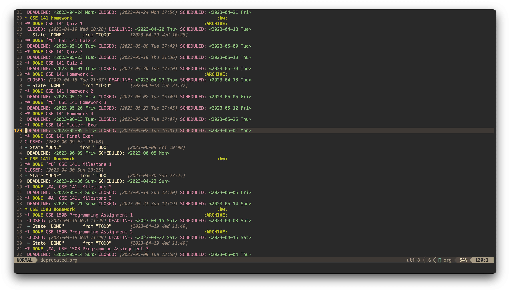
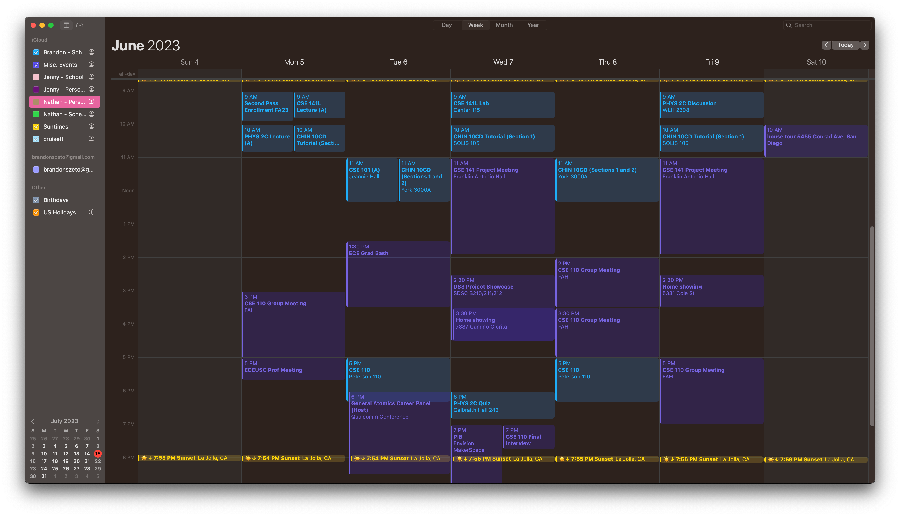
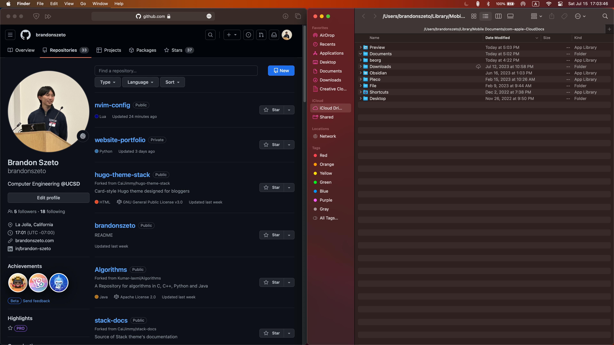

## Introduction

Since spring 2023, my productivity workflow as a student has been a combination
of 
[GitHub](https://github.com), 
[Orgmode](https://orgmode.org), 
[NeoVim](https://neovim.io), and 
[LaTeX](https://www.latex-project.org).
Further, I make the most of the useful suite of Apple applications like 
iCloud, Calendar, Notes, FaceTime, iMessages, and more, while also
taking taking full advantage of the Apple ecosystem. 

This is workflow
is largely modeled after that of my roommate's, as he has many great ideas
that I can shamelessly copy (including a website like this). 
However, with his help, I got over the
initial steep learning curves that come with Neovim, and became a power user of
native Apple applications. You can find his GitHub [here](https://github.com/nathom).

I am writing this blog post to 
document my choice of tools such that I can identify what I can improve and
ultimately boost my productivity in my coming years as a student and
professional.

## Organization: Orgmode and Calendar

Orgmode is a plain-text-based system that allows you to organize your tasks,
notes, and projects in a hierarchical structure. It provides extensive outlining
capabilities and powerful task management features. Its port to Neovim allows
for efficient navigation, editing, and searching org files in every Neovim
buffer. Lastly, syncing Orgmode with iCloud increases the ease of use by
connecting it to your iPhone.

 

Apple's default calendar app on iOS and macOS makes sure that you are always
up-to-date. I enjoy its simple UI and its integration into the Apple ecosystem,
making it extremely easy to share schedules through iMessage. However, there is
currently no way to edit .ics files through Neovim, making it a slight source of
friction. This could be a potential project I could work on in the future: a
calendar application for vim with support of .ics files.

## Files: GitHub and iCloud

The motive behind backing up personal data locally, on GitHub, and on iCloud is
to ensure comprehensive protection and accessibility for your valuable information.
By having local backups, you have immediate access to your data in case of device
failures or accidental deletions. Storing data on GitHub allows for version control,
collaboration, and remote access, particularly useful for code-related projects. 
iCloud, on the other hand, offers seamless integration, synchronization, and secure
storage for various types of personal data across Apple devices. Combining these
backup solutions provides redundancy, disaster recovery, and multiple avenues to
retrieve and safeguard your data, ensuring peace of mind and minimizing the risk of
data loss.

## Work: Neovim and LaTeX

I use Neovim, a popular modern fork of vim, to quickly edit and compile my LaTeX
files. This is possible through the thriving Neovim community who have created a
plethora of plugins that all take advantage of the powerful modal text editor
Vi. In this particular case, I am using a port of Orgmode to Neovim, VimTeX, and
UltiSnips to make typesetting and writing equations and documents extremely
fast.



My vim configuration can be found on my GitHub, and other resources I use 
(and reference myself) in my homework workflow include:
- [LaTeX Snippets](https://github.com/gillescastel/latex-snippets)
- [VimTeX Features Animated](https://github.com/lervag/vimtex/blob/master/VISUALS.md)
- [The LaTeX homework document class](https://blog.jez.io/2015/01/10/the-latex-homework-document-class/)

## Notes: Handwritten, Apple, and Markdown
I take notes digitally using Apple notes and markdown, as well as
handwrite notes when I want to learn materials or draw things that aren't
possible on a computer.

I take notes for all my lectures in a single 5.5" by 8" notebook for things that
I want to sketch out or remember thoroughly (as writing engages our motor
control centers in ways that deeply embed that information to our memory). From
here, if I want the pdf or an image I drew from my handwritten notes, I can
easily use the scan function through Apple notes, which syncs to my desktop and
can be used accordingly. Apple notes is also useful for noting links and jotting
things down quickly when you are on the move.

Lastly, there are plenty of modern markdown note-taking apps like Notion and
Obsidian but I feel that there is no need to use a third-party app when it is
essentially just markdown. As a result, I like to edit my own markdown files in
Neovim, preview them live, and easily publish the files I like as a blog (as
this website is built using Hugo, where markdown support is a core feature).

## Browser: Safari
Like Apple Calendar and Notes, I use Safari to take advantage of the Apple
ecosystem and its efficiency on Apple devices and enjoy its clean UI. The
plugins I currently use are Accelerate (can go past 2x video speed), Adblock,
and Vimari (vim keybindings in the browser). Safari provides all the
functionality I need from a browser without the excessive bloat. 

## Conclusion
Despite the high learning curve of my current workflow, it has become what works
best for me at this moment. Vim keybindings, Orgmode, and LaTeX are inherently
all difficult to pick up, but are extremely rewarding once breaking past the
learning curve. Complementing these tools with the convenient Apple ecosystem
has boosted my productivity and have definitely helped me succeed in my
university courses.
