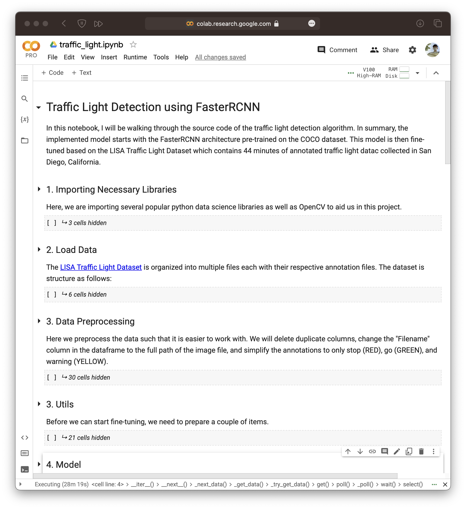
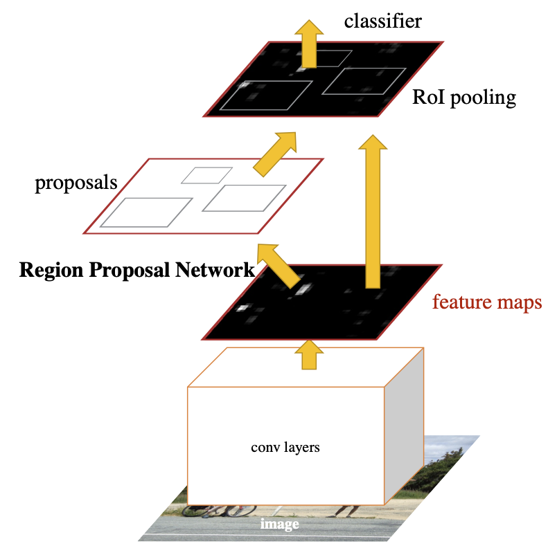
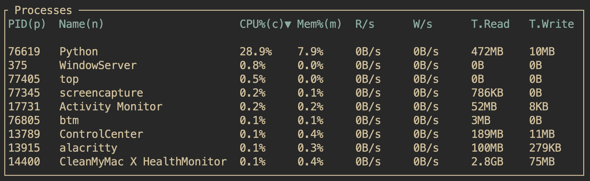
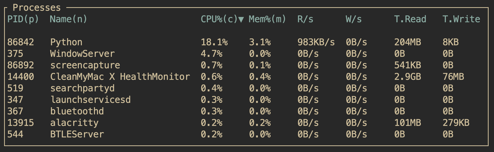

## Introduction
Just a few years ago, building and training neural networks was greatly limited
to those with access to powerful computing resources. However, the advent
of open-source deep learning libraries, pre-trained models, and cloud computing
platforms has democratized access to these powerful tools, making it easier than
ever to get started training your own neural network.

Anyone with a basic understanding of programming and mathematics can leverage
these resources to build a neural network for a specific task. This not only
saves a tremendous amount of time and investment in computational resources, but
also enables individuals to work on deep learning tasks without having to start
from scratch.

For example, nowadays, anyone with access to the internet can learn a
deep-learning framework from online resources such as [fast.ai](course.fast.ai),
use pre-trained models from open-source projects such as the 
[PyTorch Torchvision Library](https://pypi.org/project/torchvision/),
[Meta's Llama 2](https://ai.meta.com/llama/), and
[Stable Diffusion](https://github.com/Stability-AI/StableDiffusion).
As of today, these are the state-of-the-art deep-learning models for computer
vision, large language, and image generation which can all be used for free.
Additionally, many more models and datasets can be found on sites like
[Hugging Face](https://huggingface.co) and
[Kaggle](kaggle.com).
Together, with free available cloud-computing resources such as
[Google Colab](https://colab.research.google.com) and
[Kaggle](kaggle.com), individuals can train models tuned to their use case from
a laptop (Colab offers free use of T4 GPUs and offers greater compute with a pro
plan).

## Project goals

In this project, I decided to try and build a simple model that can detect
red, green, and yellow traffic lights. The ultimate goal behind this project is
to optimize the model enough to port it onto a raspberry pi to beep when a red
light turns green (a neat feature already available on Teslas). Though I ended
up with a simple prototype, it is clear that it is neither robust enough or
small enough to run on an embedded computer with 4 cores and 1 GB of RAM.

### Runtime environment

Starting this project, I ran a single Python script on my local machine (M1
Macbook Pro). However, I ran into numerous issues:

- Difficult to debug and work on different parts of a single script
- Hard to visualize and organize data with numerous `print` and `df.head()`
  statements

As such, I decided to move to a local conda environment in a jupyter notebook.
But again, I ran into hardware compatibility issues on Apple silicon. The main
point of conflict ended up being that `aten::hardsigmoid`, the activation
function used in the FasterRCNN architecture was simply not implemented for
Apple's Metal Performance Shaders (MPS), Apple's Metal GPU backend. Thus, I just
moved my entire project to Google Colab, which I found to be the easiest to work
with (though I still have some complaints):

- Training seems to be dependent on network bandwidth (no difference in training
  speed on the different T4, A100, and V100 GPUs).
- Datasets have to be uploaded to Google Drive (took about 3 hours to upload
  approximately 5 GB of data)


My notebook can be found on Google Colab [here](https://colab.research.google.com/drive/1G-HGxmRyeuBpEZBamrkpe6OHVTD56wt9?usp=sharing):

The above notebook details the training process.

I then downloaded my trained model(s) locally to run inference locally on
self-collected test data.

## Architecture Details
In training, I am taking a pre-trained FasterRCNN model and fine-tuning its weights
to recognize traffic lights. Some details of the RCNN model architecture (which
I still don't fully understand) are best described in the
[original FasterRCNN paper](https://arxiv.org/pdf/1506.01497.pdf). 

However, in summary the main feature of RCNN is to generate regions of interest
(proposals) on a given image. In this case, this would be bounding boxes. Then a
small network usally in the form of a sliding window makes several predictions.
Then non-maximum suppression filters out redundant and low-confidence proposals.
Lastly, multi-task loss is used to adjust the weights in backpropagation.



## Testing
Using a basic python script, we can load our trained model checkpoint like this:
```python
model = torchvision.models.detection.fasterrcnn_resnet50_fpn(weights=True)
model.load_state_dict(torch.load('fasterrcnn_resnet50_fpn.pth', map_location=torch.device('cpu')))
```

Using the model is as simple as running
```python
model(frame)
```
where `frame` is a given frame of a video stream. As a result, we can simply run
the model on any video we collect and judge the real-world applicability of the
model for ourselves.

### CV2 Loop
A common technique to deal with video stream in Python is to use the cv2
library. This can be done as follows:

1. Choose a source of video (here we choose between an mp4 file and our webcam)
```python
# Open the video file
video_path = "test_clip.mp4"
cap = cv2.VideoCapture(video_path)
# cap = cv2.VideoCapture(1)
```

2. Create a video loop to process the images
```python
# Loop through the video frames
while cap.isOpened():
    # Read a frame from the video
    success, frame = cap.read()

    if success:
        cv2.imshow("Sample", frame)
    else:
        break

    # Break the loop if 'q' is pressed
    if cv2.waitKey(1) & 0xFF == ord("q"):
        break
```

### Frame preprocessing
Before we begin running inference on our model, we need a way to choose which
predictions to show and draw those predictions. The following function filters
the prediction boxes we see each frame to those with a given confidence level of
above `score_threshold`. Here its default setting is `0.5`. `nms_th`, or non max
suppression threshold is simply a setting to determine how much overlap two
boxes can have before choosing the one with the higher confidence score.
```python
def filterBoxes(output,nms_th=0.3,score_threshold=0.5):
    
    boxes = output['boxes']
    scores = output['scores']
    labels = output['labels']
    
    # Non Max Supression
    mask = nms(boxes,scores,nms_th)
    
    boxes = boxes[mask]
    scores = scores[mask]
    labels = labels[mask]
    
    boxes = boxes.data.cpu().numpy().astype(np.int32)
    scores = scores.data.cpu().numpy()
    labels = labels.data.cpu().numpy()
    
    mask = scores >= score_threshold
    boxes = boxes[mask]
    scores = scores[mask]
    labels = labels[mask]
    
    return boxes, scores, labels
```
Now, to display our predictions, we can simply use cv2 to draw the boxes
returned from the `filterBoxes` function.
```python
def displayPredictions(frame, output, nms_th=0.3, score_threshold=0.5):
    
    boxes, scores, labels = filterBoxes(output, nms_th, score_threshold)
    
    # Preprocessing
    image = frame.permute(1, 2, 0).numpy()
    image = cv2.cvtColor(image, cv2.COLOR_RGB2BGR)
    
    colors = {1: (0, 255, 0), 2: (0, 255, 255), 3: (255, 0, 0)}
    label_names = {1: 'Green', 2: 'Yellow', 3: 'Red'}  # Change these to your class names
    
    box_drawn = False
    if len(boxes) > 0:
        box_drawn = True

    for box, label, score in zip(boxes, labels, scores):
        image = cv2.rectangle(image,
                               (box[0], box[1]),
                               (box[2], box[3]),
                               colors[label], 2)
        text = f'{label_names[label]}: {score:.2f}'
        image = cv2.putText(image, text, (box[0], box[1]-10), cv2.FONT_HERSHEY_SIMPLEX, 0.5, colors[label], 2)
        box_drawn = True
    
    return image, box_drawn, boxes, scores, labels
```
Lastly, to pass these frames to our model, we must prepare each frame in the
format that our model expects. Each of the following operations to the frame
address some compatibility issue between the stream of images that cv2 generates
and the format of images that our model expects. For example, cv2 produces
images in BGR format while our model expects RGB format.
```python
def process_frame(frame, model, nms_th=0.3, score_threshold=0.3):
    
    # Convert the BGR image to RGB
    frame = frame[:, :, ::-1]

    # Convert the frame to a torch tensor
    frame = torch.from_numpy(frame.copy())

    # Permute the frame to [C, H, W] from [H, W, C]
    frame = frame.permute(2, 0, 1)

    # Normalize the frame
    frame = frame / 255.0

    # Add a batch dimension
    frame = frame.unsqueeze(0)
        
    # Convert the frame to float
    frame = frame.float()

    # Run the model inference on the frame
    with torch.no_grad():
        results = model(frame)

    # Visualize the results on the frame
    annotated_frame, box_drawn, boxes, scores, labels = displayPredictions(frame[0], results[0], nms_th, score_threshold)

    return annotated_frame, box_drawn, boxes, scores, labels
```

### Video Saturation
After some testing, I found that the model tends to better when the video file
is saturated. After looking at the test data, this makes sense as the LISA
dataset seems to consist of many scenes with high contrast and high saturation.
A simple way to deal with that is to apply the following function to each frame.
```python
def edit_saturation(frame, alpha=3):
    # Convert the BGR image to HSV
    hsv = cv2.cvtColor(frame, cv2.COLOR_BGR2HSV)

    # Adjust saturation
    hsv[:,:,1] = cv2.convertScaleAbs(hsv[:,:,1], alpha=alpha)

    # Convert the HSV image back to BGR
    frame = cv2.cvtColor(hsv, cv2.COLOR_HSV2BGR)
    
    return frame
```
Here, `alpha` simply represents the degree of saturation to apply to a given
frame.

### Successfully running our model (with caveats)
Altogether, our model successfully runs ... at less than 1 fps. The two models
we've successfully fine-tuned are:
- `fasterrcnn_resnet_fpn.pth`: A FasterRCNN model with a ResNet-50-FPN backbone
- `fasterrcnn_mobilenet_v3_320.pth`: Low resolution FasterRCNN model with a
  MobileNetV3-Large backbone tuned for mobile usecases

In short, the resnet model is a slower, larger model with higher accuracy and the
mobilenet model is a faster, smaller model with lower accuracy. Examples of the
two models running in the same cv2 loop (on hand-collected data where a Tesla
accurately chimed on green light) can be seen below:

Your first impression might be that clearly the resnet model outperforms the
mobilenet model. However, these videos are generated via the video writer of
cv2, and thus stitch together all the frames in one real-time video file.
However, this fails to take into account the sheer amount of inference time just
to generate these videos. 



The following benchmarks demonstrate the approximate compute of each model on my
laptop:





## Conclusion
This project demonstrated the process of fine-tuning a deep learning model for a
specific task, in this case, traffic light detection. Despite the success of
getting the models to run and detect traffic lights in hand-collected data,
limitations around runtime performance and accuracy make both models unsuitable
for real-time applications.

Ultimately, while the prototype models developed in this project are a good
starting point, they are not yet robust or efficient enough to deployed on an
embedded computer with limited resources, such as a Raspberry Pi. Further
optimization and testing are needed to develop such a model.

### Future Work
Future work could involve experimenting with different model architectures 
(You Only Look Once (YOLO) or Single Shot Multibox Detector (SSD)) and other
optimization techniques. Additionally, I may want to manually collect and
annotate some data myself in the same lighting condition as my test data to help
improve the model's robustness. Altogether, this may allow me to deploy the
model on an embedded comptuer and integrating within other components, like a
speaker, to chime when the light turns green.

### Sources
- [Original FasterRCNN paper](https://arxiv.org/pdf/1506.01497.pdf)
- [PyTorch FasterRCNN Documentation](http://pytorch.org/vision/stable/models/faster_rcnn.html)
- [LISA Traffic Light Dataset](https://www.kaggle.com/datasets/mbornoe/lisa-traffic-light-dataset)
