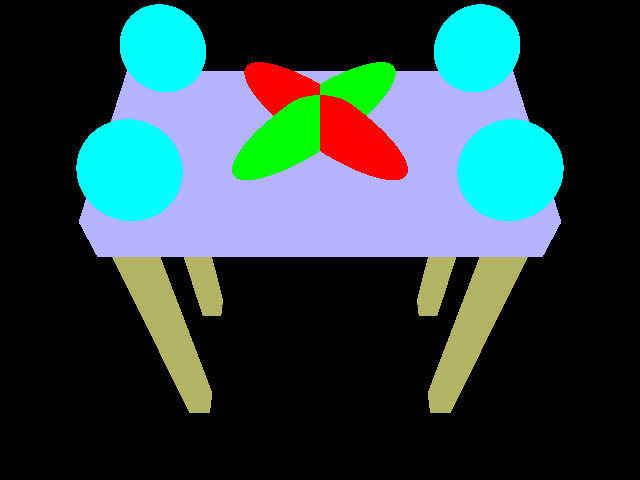
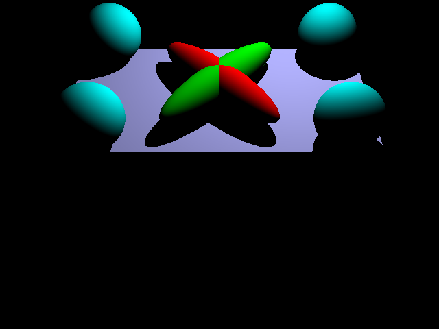
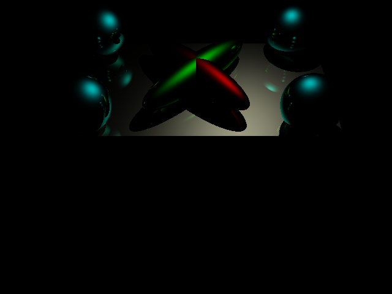
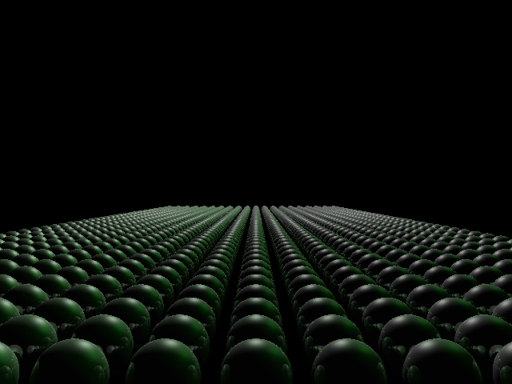
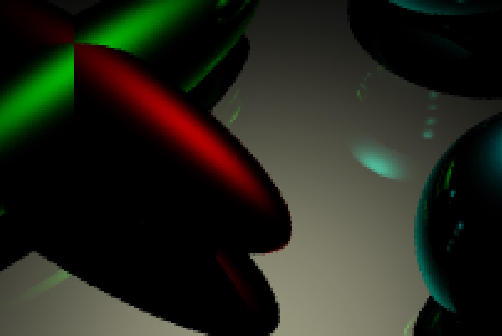
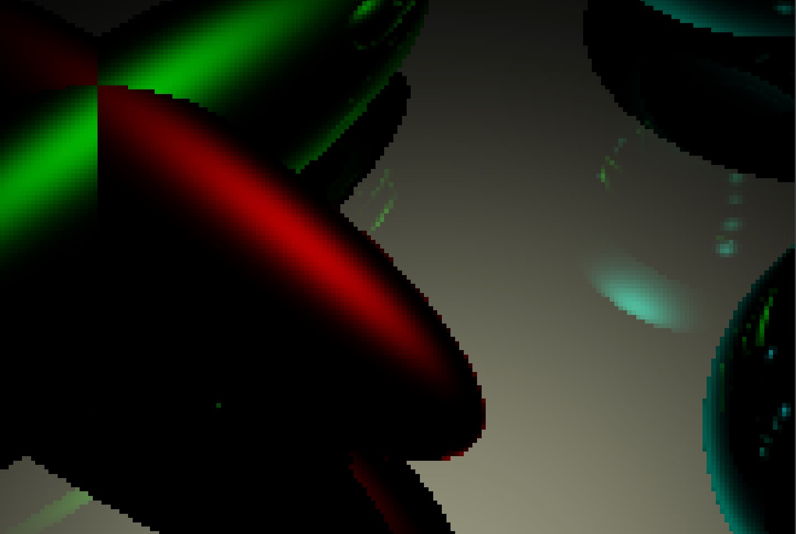
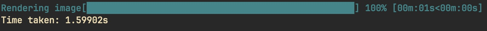

# Unveiling the Future of Photorealism: Nathan and Brandon's Revolutionary Ray Tracer

In the constantly evolving world of computer graphics, where the quest for realism and efficiency collides, a groundbreaking development has emerged from the creative minds of Nathan and Brandon. This isn't just another step forward in digital rendering; it's a giant leap towards redefining what's possible. Today, we're thrilled to introduce their latest creation: a state-of-the-art ray tracer designed to push the boundaries of photorealism and performance. Let's dive into the features that set this masterpiece apart from anything you've seen before.

## The Essence of Realism: Recursive Ray Tracing

At the heart of Nathan and Brandon's ray tracer lies the core principle of recursive ray tracing. This technique mimics the natural behavior of light, including reflections, refractions, and shadows, by recursively following rays of light as they interact with surfaces in a virtual environment. The result is stunningly realistic images that breathe life into every scene, capturing nuances that were previously the domain of the real world.


## Material Mastery: Full Definitions for Specular, Ambient, Emission, and More

What truly sets a scene apart is its materials. Nathan and Brandon's ray tracer features comprehensive material definitions, allowing for an unprecedented level of detail and realism. Specular highlights glint off surfaces with photorealistic sharpness, ambient light gently illuminates every corner, and emission properties bring light sources to vibrant life. Every material, from the roughest stone to the smoothest metal, is rendered with astonishing accuracy.






## A Symphony of Light: Multiple Light Sources

Lighting is the soul of any scene, and this ray tracer handles it with unparalleled mastery. With support for multiple light sources, Nathan and Brandon's creation can simulate complex lighting scenarios, from the soft glow of dawn to the harsh shadows of a midday sun. Each light source contributes to the overall illumination, casting shadows and highlights that interact dynamically with the environment.



## Unleashing Performance: Multithreading and Cache Optimization

Underneath its stunning visuals, Nathan and Brandon's ray tracer is a marvel of engineering. Leveraging multithreading, it harnesses the full power of modern processors to render scenes at breathtaking speeds. But raw power isn't everything; efficiency is just as important. Through meticulous optimization of cache access patterns, this ray tracer achieves a level of performance that sets a new standard for the industry.

## The Need for Speed: KD Trees for Blazing Fast Rendering

One of the most innovative features of Nathan and Brandon's ray tracer is its use of KD trees. These spatial data structures dramatically accelerate the rendering process by efficiently organizing the virtual environment. The result is lightning-fast render times without compromising on detail or realism, making it possible to bring even the most complex scenes to life in a fraction of the time it used to take.


## The Speed of Light: KD Trees Unlocked

Diving deeper into the world of Nathan and Brandon's ray tracer, one finds the brilliance of KD trees—a feature that exemplifies the perfect blend of mathematical ingenuity and software engineering. KD trees, or k-dimensional trees, are a spatial partitioning data structure used to organize points in a k-dimensional space. Nathan and Brandon have adapted this powerful concept to revolutionize the rendering process, enabling their ray tracer to handle complex scenes with extraordinary speed and efficiency.

### Understanding KD Trees

At its core, the implementation of KD trees in this ray tracer is about dividing the 3D space into nested, hierarchically organized segments, where each node represents a bounding box containing a portion of the scene's objects. The beauty of this approach lies in its recursive division strategy, which significantly reduces the number of comparisons needed to determine which objects a ray intersects. This method hinges on a few key pieces of code and concepts that merit a closer look.

#### The Code Behind the Magic

Nathan and Brandon's implementation begins with a foundational element: the determination of whether to treat a segment of space as a leaf node or to further divide it. This decision is based on a simple yet effective metric—the `LEAFSIZE` constant, which dictates the maximum number of objects a leaf node can contain before requiring division:

```cpp
if ((int)v.size() < LEAFSIZE) {
    is_leaf = true;
    this->objects = v;
    return;
}
```

For non-leaf nodes, the space is split into two halves based on a median point calculated along the dimension being considered. This process involves sorting object midpoints along the current dimension and selecting a cut point that ideally balances the distribution of objects on either side:

```cpp
double cut = (list[(int)list.size() / 2] + list[((int)list.size() / 2) - 1]) / 2;
```

The `split` method demonstrates a nuanced approach to spatial division, adjusting the bounding boxes of child nodes to reflect the partition:

```cpp
void split(int dim, double cut, BBox &lbox, BBox &rbox) {
    // Dimension-based splitting logic
}
```

Perhaps the most compelling aspect of this implementation is the intersection logic, which efficiently determines whether a ray intersects objects within the KD tree. By first checking intersection with the bounding box, and then recursively with child nodes or directly with objects in the case of leaf nodes, the algorithm minimizes unnecessary computations:

```cpp
if (!box.contains_ray(r)) {
    return false;
}
if (is_leaf) {
    // Check for intersection with objects in the leaf node
}
```

### The Benefits Unfold

The KD tree's strategic partitioning of 3D space directly translates to faster rendering times, as it allows the ray tracer to quickly eliminate large portions of the scene from consideration when calculating ray-object intersections. This efficiency is critical for rendering complex scenes, where the difference between a usable and an impractical application can hinge on render times.

Moreover, Nathan and Brandon's attention to optimizing cache access patterns in conjunction with the KD tree's efficiency ensures that the ray tracer not only accelerates the rendering process but does so in a way that maximizes hardware performance. By ensuring data locality and minimizing cache misses, the ray tracer achieves a level of performance that is as impressive in its technical execution as it is in its visual output.

In essence, the inclusion and optimization of KD trees within Nathan and Brandon's ray tracer are a testament to their mastery over both the theoretical and practical aspects of computer graphics. This feature not only enhances the ray tracer's efficiency but also solidifies its position as a cutting-edge tool capable of bringing the most intricate digital worlds to life.

## The Multithreading Miracle: Supercharging Rendering with Parallel Processing

In the realm of computer graphics, where complexity meets creativity, Nathan and Brandon have once again pushed the envelope with their latest innovation in rendering technology. This time, the magic lies in the art of multithreading, a technique that has propelled their ray tracer into the stratosphere of performance, delivering a staggering 10x speedup in rendering times. But how did they achieve such a feat? Let's dive into the heart of their multithreading masterpiece to uncover the secrets behind this transformative approach.

### Breaking Down the Boundaries: Parallel Processing Explained

At its core, multithreading is about dividing a task into smaller, concurrently executable chunks, allowing multiple processors to work in parallel, significantly reducing overall processing time. Nathan and Brandon have masterfully applied this principle to the rendering process with a strategy that's as elegant as it is effective.

#### Code That Flies

The `render_to_image` function showcases the brilliance of their approach. By splitting the image into chunks, with each chunk assigned to a separate thread, the rendering task is parallelized across multiple cores:

```cpp
thread workers[NTHREADS];
for (int n = 0; n < NTHREADS; n++) {
    const int i2 = min(i + i_chunk_size, image_height);
    workers[n] = thread(render_chunk<Antialiasing>, img, scene, i, i2, 0,
                        image_width, ref(done[n]));
    i += i_chunk_size;
}
```

This ingenious division of labor means that instead of waiting for a single process to painstakingly render an image pixel by pixel, multiple segments of the image are brought to life simultaneously. The result? A dramatic reduction in waiting times, making what was once a time-consuming process astonishingly swift.

#### The Antialiasing Twist

Adding to this, the template parameter `Antialiasing` in the `render_chunk` function allows the renderer to adapt dynamically based on the need for antialiasing—a technique that smooths out the edges of objects, enhancing the quality of the final image. With antialiasing enabled, each pixel's color is the average of several sampled colors around the original pixel, requiring more computations but resulting in a higher quality image:

```cpp
if constexpr (Antialiasing) {
    for (int n = 0; n < NUM_SAMPLES_PER_PIXEL; n++) {
        pixel_color += scene.pixel_at<Antialiasing>(i, j);
    }
    pixel_color /= NUM_SAMPLES_PER_PIXEL;
} else {
    pixel_color = scene.pixel_at<Antialiasing>(i, j);
}
```

This feature, when combined with multithreading, ensures that even the most detail-rich, antialiased images are rendered at speeds that were previously unimaginable.




### A Symphony of Threads

What truly sets Nathan and Brandon's multithreading solution apart is its meticulous orchestration. Each thread works in perfect harmony, synchronized to ensure that the rendering process is smooth and efficient. The use of `atomic_bool &done_flag` for each thread allows for precise monitoring and coordination, ensuring that every piece of the image puzzle is completed on time, without overlaps or gaps.

The progress bar integration, using a block progress bar from the `indicators` namespace, not only visually tracks the rendering progress in real-time but also adds a touch of elegance to the user experience, making the wait (albeit much shorter now) more engaging.

[Insert Sample Image: Visual Representation of Multithreading in Action]

### The Result: Unprecedented Speed

The culmination of these efforts is a rendering engine that operates at a speed which was once deemed unattainable. The 10x speedup in rendering times is not just a number; it's a game-changer, opening up new possibilities for creators, animators, and graphics professionals who can now bring their visions to life faster than ever before.

In the hands of Nathan and Brandon, multithreading is not just a technical strategy; it's a gateway to a new era of digital art and design, where the only limit is one's imagination. Their ray tracer, supercharged by parallel processing, stands as a beacon of innovation, showcasing what's possible when technology meets creativity. The future of rendering is here, and it's more vibrant, more detailed, and significantly faster, thanks to the genius of Nathan and Brandon.

## Mastering the Art of Antialiasing

In the pursuit of creating images that blur the line between digital and reality, Nathan and Brandon introduced an ingenious implementation of antialiasing in their revolutionary ray tracer. Antialiasing, a technique designed to eliminate jagged edges that make computer graphics appear less realistic, is a crucial part of achieving photorealism. But implementing it efficiently and effectively can be challenging. Here's how they tackled it with a blend of mathematical precision and computational wizardry, leveraging the power of `constexpr` for zero runtime cost.

### The Magic of Compile-Time Decisions

Antialiasing can significantly increase the computational load of a rendering process, as it requires generating multiple rays per pixel to average out the color and smooth out the edges. Nathan and Brandon's approach smartly mitigates this overhead using `constexpr` and template metaprogramming, ensuring that the decision to antialias or not is made at compile time:

```cpp
template <bool Antialiasing>
void render_chunk(FIBITMAP *img, Scene const &scene, int start_i, int end_i,
                  int start_j, int end_j, atomic_bool &done_flag) {
    // Code for rendering each chunk
    if constexpr (Antialiasing) {
        // Antialiasing logic
    } else {
        // Non-antialiasing logic
    }
}
```

This method allows the compiler to generate two versions of the `render_chunk` function: one that implements antialiasing and one that doesn't. At runtime, there's no decision-making or conditional logic involved; the appropriate version of the function runs based on the template parameter provided at compile time, eliminating any runtime cost associated with this choice.

### Antialiasing in Action

The antialiasing implementation revolves around averaging color samples for each pixel, with each sample perturbed slightly to simulate the effect of rays hitting different parts of the pixel. This is where the brilliance of their method shines:

```cpp
if constexpr (Antialiasing) {
    for (int n = 0; n < NUM_SAMPLES_PER_PIXEL; n++) {
        // Ray contains some noise for random sampling
        pixel_color += scene.pixel_at<Antialiasing>(i, j);
    }
    pixel_color /= NUM_SAMPLES_PER_PIXEL;
} else {
    pixel_color = scene.pixel_at<Antialiasing>(i, j);
}
```

For scenes rendered with antialiasing, multiple samples are averaged to determine the color of each pixel, creating a smoother, more realistic image. The `NUM_SAMPLES_PER_PIXEL` constant controls the number of samples, allowing for a balance between quality and performance.

### The Role of Random Sampling

The method of generating rays for each sample plays a pivotal role in the effectiveness of the antialiasing:

```cpp
if constexpr (Antialiasing) {
    // Get random point in pixel square
    r_i = i + random_double();
    r_j = j + random_double();
} else {
    // Get center
    r_i = i + 0.5;
    r_j = j + 0.5;
}
```

By adjusting the ray's origin within the pixel, the algorithm simulates the effect of light hitting the pixel from various angles, smoothing out the edges and reducing the appearance of jagged lines. This approach not only enhances the visual quality of the rendered image but also demonstrates an elegant application of `constexpr` to control the complexity of the rendering process.

## Elevating User Experience: The Ingenious Progress Bar

In their relentless pursuit of excellence, Nathan and Brandon have not only focused on the technological advancements of their ray tracer but also on enhancing the user experience. A testament to this dedication is the incorporation of a sophisticated progress bar that provides real-time updates and time estimates during the rendering process. This feature represents more than just a user interface element; it's a bridge connecting the user to the complex computations happening behind the scenes.



### A Glimpse into the Rendering Journey

Rendering high-quality images, especially with techniques like recursive ray tracing and antialiasing, can be time-consuming. Users, whether they are artists, designers, or hobbyists, appreciate feedback on the progress of their rendering tasks. Nathan and Brandon's progress bar offers this feedback in a visually engaging and informative manner:

```cpp
BlockProgressBar bar{
    option::BarWidth{50}, option::ShowElapsedTime{true},
    option::ShowRemainingTime{true},
    option::PrefixText{"Rendering image"},
    option::ForegroundColor{Color::blue},
};
```

### Real-Time Feedback and Estimates

The progress bar is meticulously designed to provide essential information at a glance. It showcases the percentage of the rendering process completed, the elapsed time, and an estimate of the remaining time. This feature not only keeps the user informed but also enhances the overall interaction with the ray tracer, making the wait more bearable and engaging.

The real magic of the progress bar lies in its ability to dynamically update as the rendering process unfolds. Each chunk of the image being rendered contributes to the progress, and the bar adjusts accordingly, offering a real-time glimpse into the computational effort involved:

```cpp
while (finished < NTHREADS) {
    int finished_cnt = 0;
    for (int n = 0; n < NTHREADS; n++) {
        if (done[n]) finished_cnt++;
    }
    bar.set_progress(finished_cnt * (100.0 / NTHREADS));
    this_thread::sleep_for(1ms); // Minimal delay to avoid busy waiting
}
bar.mark_as_completed();
```

### Enhancing the Rendering Experience

This intuitive progress bar does more than just track progress; it transforms the rendering process into a visually satisfying experience. Users can see exactly how much work has been done and how much is left, allowing them to manage their time efficiently or take a well-deserved break while waiting for the magic to unfold.

Nathan and Brandon's inclusion of the progress bar in their ray tracer exemplifies their holistic approach to software development, where user experience and technical excellence go hand in hand. It's a small yet impactful feature that significantly enhances the usability and appeal of their creation, making the art of rendering not just a process, but an experience to look forward to.


In conclusion, I want to extend my heartfelt thanks to Professor [Ravi Ramamoorthi](https://cseweb.ucsd.edu/~ravir/) for his exceptional teaching and guidance. His passion and expertise have not only deepened our understanding of complex subjects but also inspired us to pursue excellence in our own paths. Additionally, the hard work and dedication of all the teaching assistants involved in grading and providing feedback have been invaluable to our learning journey. Their efforts greatly enhanced our educational experience, for which we are profoundly grateful. This journey has been enriching, thanks to their collective dedication and support.
