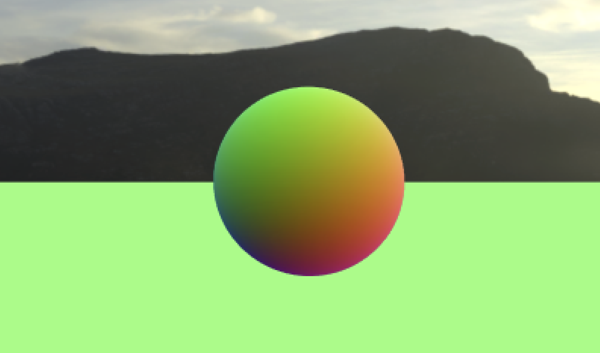
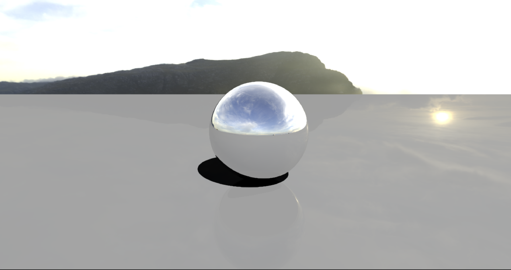
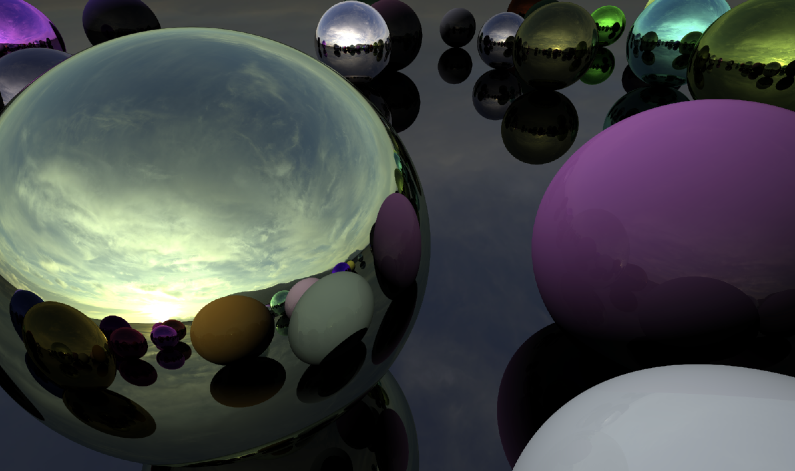

## Introduction
[Rendering](https://en.wikipedia.org/wiki/Rendering_(computer_graphics))
is the processor of generating an image from a 2D or 3D model by means
of a computer program. It can be compared ot taking a photo of a scene in real
life. Like how there are many cameras (e.g. DLSR, film, mirrorless) that each
produce a different result, there are many rendering techniques that (e.g.
polygon-based, scanline, radiosity, ray-tracing) that each have different
tradeoffs. Today, we will be looking at ray-tracing.

In the real-world, photons collide with objects where it will
be reflected or refracted while losing some energy along the way. Eventually,
the photons end up in a camera's image sensor which in turn produces an image. 
Ray-tracing aims to simulate the physics of real-world optics by tracing the
path of rays to the camera. However, simulating every individual photon emitted
from a light source is computationally expensive. In our simulation, we can use
the principle of 
[Helmholtz reciprocity](https://en.wikipedia.org/wiki/Helmholtz_reciprocity) 
to instead only shoot rays from the
camera into the scene that will hit a light source. This, in combination with
offloading computational load to GPUs have made ray-tracing one of the most
popular rendering techniques to this day.

### C# Script 
Let's leverage an existing game engine, [Unity](https://unity.com), to play with
ray-tracing. This allows us access to features like an editor and asset
manager to simplify our development. 

In a new Unity project, I created a C# script. Here, we declare a couple of
things:

A reference to our compute shader (technique to speed up computation, hence
'compute'):
```csharp
public ComputeShader RayTracingShader;
```

Our frame as a Unity `RenderTexture` object (the underscore prefix '_' is a
convention to indicate a private variable):
- This can be thought of as an individual frame that we will be writing to
```csharp
private RenderTexture _target;
```

`OnRenderImage()`, `Render()`, and `InitRenderTexture()` functions that work
together to initiate ray-tracing calculations using a compute shader (that we
will soon write).

`OnRenderImage()` is a Unity built-in function called whenever an object is
  being rendered. Here, it will serve as a post-processing step to initiate the
  ray-tracing process and display the result on the screen.
```csharp
private void OnRenderImage(RenderTexture source, RenderTexture destination)
{
    Render(destination);
}
```
`InitRenderTexture()` creates `_target` if it doesn't exist or if its dimensions
don't match screen dimensions. We release the render texture if it already
exists, then create a new render texture using the
`RenderTextureFormat.ARGBFloat` format, which allows for high-precision
floating-point values for accurate ray-tracing calculations. `enableRandomWrite`
is set to true in order to enable the compute shader to write to the render
texture.
```csharp
private void InitRenderTexture()
{
    if (_target == null || _target.width != Screen.width || _target.height != Screen.height)
    {
        // Release render texture if we already have one
        if (_target != null)
            _target.Release();

        // Get a render target for Ray Tracing
        _target = new RenderTexture(Screen.width, Screen.height, 0,
            RenderTextureFormat.ARGBFloat, RenderTextureReadWrite.Linear);
        _target.enableRandomWrite = true;
        _target.Create();
    }
}
```
`Render()` is responsible for ray-tracing and displaying the result. Notably,
it 
- Calls `InitRenderTexture()` to ensure that `_target` is properly
  initialized
- Sets `_target` to a parameter called "Result" in the compute
  shader
- Calculates the number of thread groups needed for the compute shader
  based on screen dimensions
- Dispatches the compute shader, with a specified kernel index and number of
  thread groups in the x and y dimensions 
- Copies the content of the `_target` texture to the destination, displaying the
  result on the screen

```csharp
private void Render(RenderTexture destination)
{
    InitRenderTexture();

    RayTracingShader.SetTexture(0, "Result", _target);
    
    int threadGroupsX = Mathf.CeilToInt(Screen.width / 8.0f);
    int threadGroupsY = Mathf.CeilToInt(Screen.height / 8.0f);

    RayTracingShader.Dispatch(0, threadGroupsX, threadGroupsY, 1);

    Graphics.Blit(_target, destination);
}
```

Now, let's initialize a Unity `Camera` object that will be attached to our main
camera.
- In Unity, the `Awake()` method is called when a GameObject script is
  initialized. Here, the script retrieves the reference to the Camera component
  and assigns it to the private `_camera` variable.
- Now, in a separate method `SetShaderParameters()`, we set two matrices in our
  compute shader.
    - `_camera.cameraToWorldMatrix` represents the transformation matrix that
      converts points from the camera's local space to world space. This will be
      used to transform rays and objects into the appropriate coordinate system.
    - `_camera.projectionMatrix.inverse` represents the inverse of the camera's
      projection matrix. This will also be useful for ray-tracing calculations,
      like reconstructing the rays in world space from screen coordinates.
      
Note: *These matrices are not matrices of pixels, but rather represent transformation
  and projection information to aid with manipulating points and vectors in 3D
  space.*
```csharp
private Camera _camera;

private void Awake()
{
    _camera = GetComponent<Camera>();
}

private void SetShaderParameters()
{
    RayTracingShader.SetMatrix("_CameraToWorld", _camera.cameraToWorldMatrix);
    RayTracingShader.SetMatrix("_CameraInverseProjection", _camera.projectionMatrix.inverse);
}
```

### Compute Shader
Now, let's move on to our compute shader.

Note: *In HLSL, a function or variable declaration needs to appear before it is
used.*

To begin, we have:
```csharp
#pragma kernel CSMain
```
a preprocessor directive specific to compute shaders in HLSL. It designates
`CSMain` as the entry point or the main kernel function in the compute shader.
"#pragma" is a directive used to provide additinoal instructions to the compiler
or specific compiler optimizations. In our case, speaking to the GPU to run
multiple threads in parallel to speed up our ray-tracing computation.
In the context of parallel computing, "kernel" refers to a specific type fo
function that is execute on multiple threads or processing units, which we will
go into further depth later.

Next, we declare global variables that we passed into the compute shader from
our C# script:
```csharp
RWTexture2D<float4> Result;
float4x4 _CameraToWorld;
float4x4 _CameraInverseProjection;
```

Now, we create a ray struct which holds information about individual rays
(which we will add to later), and a function to easily create a `Ray` struct.
```csharp
struct Ray
{
    float3 origin;
    float3 direction;
};

Ray CreateRay(float3 origin, float3 direction)
{
    Ray ray;
    ray.origin = origin;
    ray.direction = direction;
    return ray;
}
```

Now, we use information from our camera matrices to calculate the origin and
direction of a `Ray` from the camera's perspective to the world space.
- `float3 origin = mul(_CameraToWorld, float4(0.0f, 0.0f, 0.0f, 1.0f)).xyz;`
  transforms the camera's local origin to world space.
- The following three lines takes the inverse of the camera's perspective
  projection matrix, `_CameraInverseProjection` and the `uv` vector, and converts it into a 3D vector in
  view space. Then, the vector is transformed from view space to world space,
  using the `_CameraToWorld` matrix and is normalized.
- Lastly, we return the ray with the appropriate origin and direction values.
```csharp
Ray CreateCameraRay(float2 uv)
{
    float3 origin = mul(_CameraToWorld, float4(0.0f, 0.0f, 0.0f, 1.0f)).xyz;
    
    float3 direction = mul(_CameraInverseProjection, float4(uv, 0.0f, 1.0f)).xyz;
    direction = mul(_CameraToWorld, float4(direction, 0.0f)).xyz;
    direction = normalize(direction);

    return CreateRay(origin, direction);
}
```

Lastly, we declare our compute shader main function, `CSMain()`.
- `[numthreads(8,8,1)]` indicates the size of the thread group where the compute
  shader is executed. In this case, each thread group handles 8x8 = 64 pixels.
- `width` and `height` store the dimensions of our screen.
- `uv` contains the normalized screen coordinates for the thread based on its
  thread ID. We expand the range of the coordinates from [0,1] to [-1,1] to
  align the coordinate system with the GPU's conventional coordinate system.
  This is accomplished with some basic arithmetic.
- Next, we create a ray for each `uv` and write some random colors (for now).
All this code is being run in parallel, as we calculate the rays for the
entire texture.

```csharp
[numthreads(8,8,1)]
void CSMain (uint3 id : SV_DispatchThreadID)
{
    // Get the dimensions of the RenderTexture
    uint width, height;
    Result.GetDimensions(width, height);

    // Transform pixel to [-1,1] range
    float2 uv = float2((id.xy + float2(0.5f, 0.5f)) / float2(width, height) * 2.0f - 1.0f);

    // Get a ray for the UVs
    Ray ray = CreateCameraRay(uv);

    // Write some colors
    Result[id.xy] = float4(ray.direction * 0.5f + 0.5f, 1.0f);
}
```

This yields a scene that looks like this:


All processed parallely on the GPU!

## Skybox
Now, let's implement a custom skybox (a texture for our sky). This can be
accomplished by finding an asset that you like (in my example, I am using a
picture of a hill), and assigning it to a texture in the inspector. Don't forget
to declare:
```csharp
public Texture SkyboxTexture;
```
and let the compute shader know about it:
```csharp
RayTracingShader.SetTexture(0, "_SkyboxTexture", SkyboxTexture);
```
In the shader, let's define the texture and a constant $\pi$ to help us sample
the skybox and transform our cartesian direction vector to spherical coordinates
and map this to texture coordinates. Fortunately, skybox sampling is a common
technique in rendering, and we can simply use the following lines of code to
correctly normalize and sample our texture in a sphere.
```csharp
float theta = acos(ray.direction.y) / -PI;
float phi = atan2(ray.direction.x, -ray.direction.z) / -PI * 0.5f;
Result[id.xy] = _SkyboxTexture.SampleLevel(sampler_SkyboxTexture, float2(phi, theta), 0);
```

## Tracing
Here, we define a struct `RayHit` in our shader to help us render objects.
`position` and `distance` are simply the position and distance of a collision
relative to the camera. `normal` is the normal vector of a given ray and object
collision.
```csharp
struct RayHit
{
    float3 position;
    float distance;
    float3 normal;
};

RayHit CreateRayHit()
{
    RayHit hit;
    hit.position = float3(0.0f, 0.0f, 0.0f);
    hit.distance = 1.#INF;
    hit.normal = float3(0.0f, 0.0f, 0.0f);
    return hit;
}
```

## Plane
Now, let's add the ground plane. Here, we are creating a ground plane by finding
the point of intersection between a ray and a plane at $y = 0$, then updating
the bestHit given that the intersection is both positive and closer than all
previous hits.
- We can think of finding the intersection as the following linear equation: 
`ray.direction.y * t + ray.origin.y = 0` of the form $mx + b$. 

```csharp
void IntersectGroundPlane(Ray ray, inout RayHit bestHit)
{
    // Calculate distance along the ray where the ground plane is intersected
    float t = -ray.origin.y / ray.direction.y;
    if (t > 0 && t < bestHit.distance)
    {
        bestHit.distance = t;
        bestHit.position = ray.origin + t * ray.direction;
        bestHit.normal = float3(0.0f, 1.0f, 0.0f);
    }
}
```

Note: *HLSL parameters are passed by value, not reference. Thus, we must pass in
the `RayHit` with the `inout` qualifier to modify the original struct.
Otherwise, we would only be working on a copy and never propagate changes to the
calling function.*

To use this, we will add a `Trace` function for each `RayHit` object, and a
basic shading function.

```csharp
RayHit Trace(Ray ray)
{
    RayHit bestHit = CreateRayHit();
    IntersectGroundPlane(ray, bestHit);
    return bestHit;
}

float3 Shade(inout Ray ray, RayHit hit)
{
    if (hit.distance < 1.#INF)
    {
        // Return the normal
        return hit.normal * 0.5f + 0.5f;
    }
    else
    {
        // Sample the skybox and write it
        float theta = acos(ray.direction.y) / -PI;
        float phi = atan2(ray.direction.x, -ray.direction.z) / -PI * 0.5f;
        return _SkyboxTexture.SampleLevel(sampler_SkyboxTexture, float2(phi, theta), 0).xyz;
    }
}
```
Notice that we've moved the skybox sampling code into the shade function. Here,
we return the normal if the `RayHit` object encountered a collision, and
otherwise, use our skybox sampling code.

Now, we must use both functions in `CSMain` like the following:
```csharp
RayHit hit = Trace(ray);
float3 result = Shade(ray, hit);
Result[id.xy] = float4(result, 1);
```

## Sphere
To implement a basic sphere, we will use 
[line-sphere intersection](https://en.wikipedia.org/wiki/Line–sphere_intersection).
There exist two possible collisions: the entry point and the exit point. We will
use the entry point first and only use the exit point if the other one is not
valid. Thus, a sphere can be defined as:
```csharp
void IntersectSphere(Ray ray, inout RayHit bestHit, float4 sphere)
{
    float3 d = ray.origin - sphere.xyz;
    float p1 = -dot(ray.direction, d);
    float p2sqr = p1 * p1 - dot(d, d) + sphere.w * sphere.w;
    if (p2sqr < 0)
        return;
    float p2 = sqrt(p2sqr);
    float t = p1 - p2 > 0 ? p1 - p2 : p1 + p2;
    if (t > 0 && t < bestHit.distance)
    {
        bestHit.distance = t;
        bestHit.position = ray.origin + t * ray.direction;
        bestHit.normal = normalize(bestHit.position - sphere.xyz);
    }
}
```
To add a sphere, we will call this function from `Trace` like:
```csharp
IntersectSphere(ray, bestHit, float4(0, 3.0f, 0, 1.0f));
```

## Anti-Aliasing
Currently, we are only testing the center of each pixel with a single ray. This
results in jagged edges due to a smaller number of samples. To circumvent this,
we can trace multiple rays per pixel, with a random offset inside the pixel's
region. To reduce the computational load, we will trace one ray per pixel each
frame and average the result over time if the camera didn't move.

This can be fixed using an image effect shader written in Unity's ShaderLab
language:
```csharp
Shader "Hidden/AddShader"
{
	Properties
	{
		_MainTex ("Texture", 2D) = "white" {}
	}
	SubShader
	{
		// No culling or depth
		Cull Off ZWrite Off ZTest Always
		Blend SrcAlpha OneMinusSrcAlpha

		Pass
		{
			CGPROGRAM
			#pragma vertex vert
			#pragma fragment frag
			
			#include "UnityCG.cginc"

			struct appdata
			{
				float4 vertex : POSITION;
				float2 uv : TEXCOORD0;
			};

			struct v2f
			{
				float2 uv : TEXCOORD0;
				float4 vertex : SV_POSITION;
			};

			v2f vert (appdata v)
			{
				v2f o;
				o.vertex = UnityObjectToClipPos(v.vertex);
				o.uv = v.uv;
				return o;
			}
			
			sampler2D _MainTex;
			float _Sample;

			float4 frag (v2f i) : SV_Target
			{
				return float4(tex2D(_MainTex, i.uv).rgb, 1.0f / (_Sample + 1.0f));
			}
			ENDCG
		}
	}
}
```
This is mostly default settings other than the lines:
```csharp
Blend SrcAlpha OneMinusSrcAlpha
```
and 
```csharp
float _Sample;

float4 frag (v2f i) : SV_Target
{
    return float4(tex2D(_MainTex, i.uv).rgb, 1.0f / (_Sample + 1.0f));
}
```
which together enable alpha blending and draws sampels with a diminishing
opacity. We will use this in our script by adding the following to utilize
our samples and update changes to our camera.
```csharp
private uint _currentSample = 0;
private Material _addMaterial;

private void Update()
{
    if (transform.hasChanged)
    {
        _currentSample = 0;
        transform.hasChanged = false;
    }
}
```

Adding our image shader to our `Render` function:
```csharp
if (_addMaterial == null)
    _addMaterial = new Material(Shader.Find("Hidden/AddShader"));
_addMaterial.SetFloat("_Sample", _currentSample);
Graphics.Blit(_target, destination, _addMaterial);
_currentSample++;
```

Now, we need to create a random offset to sample in order to get the average
gradient and smooth the jagged edges. In our compute shader, we can define the
following:
```csharp
float2 _PixelOffset;
```
and replace our hard-coded `float2(0.5f, 0.5f)` offset with a random value:
```csharp
RayTracingShader.SetVector("_PixelOffset", new Vector2(Random.value, Random.value));
```

On the left, we see our result before the image shader. On the right, we see our
result after the image shader. However, if you move the camera, we will still
see aliasing for a couple of frames before it the texture has a chance to
average out.




## Reflection
In the real world, when light hits an object, different amount of protons bounce
off the object depending on its material. Extremely reflective objects reflect
most of the light and a majority of the energy in the proton is retained.
Something else to remember from physics is that the incident angle is equal to
the angel fo reflection. This will help us dictate how light bounces off objects
in our render.

Let's first tackle the problem of reflectivity. As light bounces from object to
object, the energy of the ray rapidly diminishes or the ray exits the scene.
This can be described with a `float3 energy` that we will add to the `Ray`
struct. The ray is initialized with `float3(1.0f, 1.0f, 1.0f)`, or full
throughput on all color channels.

To make the energy of the ray diminish, let's add the following to `CSMain`,
replacing our previous `Trace` and `Shade` calls:
```csharp
// Trace and shade
float3 result = float3(0, 0, 0);
for (int i = 0; i < 8; i++)
{
    RayHit hit = Trace(ray);
    result += ray.energy * Shade(ray, hit);

    if (!any(ray.energy))
        break;
}
```
Now, our shade function will be responsible for both updating the energy and
generating the reflected ray. To update energy, we will perform an element-wise
multiplication with the specular color of the surface. For example, gold has a
specular reflectivity of roughly `float3(1.0f, 0.78f, 0.24f)`, so it will
reflect 100% of red light, 78% of green light, and only 34% of blue light,
together creating a golden tint.

HLSL has a built-in function to reflect a ray using a given normal, so we can
use the normal we've already declared. Our new shade function looks like:
```csharp
float3 Shade(inout Ray ray, RayHit hit)
{
    if (hit.distance < 1.#INF)
    {
        float3 specular = float3(0.6f, 0.6f, 0.6f);

        // Reflect the ray and multiply energy with specular reflection
        ray.origin = hit.position + hit.normal * 0.001f;
        ray.direction = reflect(ray.direction, hit.normal);
        ray.energy *= specular;

        // Return nothing
        return float3(0.0f, 0.0f, 0.0f);
    }
    else
    {
        // Erase the ray's energy - the sky doesn't reflect anything
        ray.energy = 0.0f;

        // Sample the skybox and write it
        float theta = acos(ray.direction.y) / -PI;
        float phi = atan2(ray.direction.x, -ray.direction.z) / -PI * 0.5f;
        return _SkyboxTexture.SampleLevel(sampler_SkyboxTexture, float2(phi, theta), 0).xyz;
    }
}
```
Notice that we add a slight offset to the normal direction. This is to fix
floating point inaccuracy, as it is possible for a reflected ray to be blocked
by the surface it is being reflected by.

Here is the result of rendering some reflective spheres in a loop:


## Directional Light and Materials
Let's introduce two new properties of the `RayHit` struct in our shader,
`float3 albedo` and `float3 specular`. Specular reflection refers to highlights
caused by direct reflections of light sources. Adjusting this value will let us
adjust how much light is diffused into the surface normal, creating new
materials other than just the chrome finished spheres we have rendered. On the
other hand, albedo refers to the color of the surface when illuminated by a
light source. Together, adjusting these two values will allow us to simulate
many more surfaces in our ray tracer. This is called diffuse lighting, and the
topic is further discussed in this [Stack Exchange post](https://computergraphics.stackexchange.com/questions/1513/how-physically-based-is-the-diffuse-and-specular-distinction).

In order to implement these properties, let's add the following to our compute
shader:
```csharp
struct Sphere
{
    float3 position;
    float radius;
    float3 albedo;
    float3 specular;
};
```
and the following to the C# script:
```csharp
struct Sphere
{
    public Vector3 position;
    public float radius;
    public Vector3 albedo;
    public Vector3 specular;
}
```
Let's update our `SetShaderParameters` fucntion to regonize our new directional
light vector each time we update our camera.
```csharp
public Light DirectionalLight;

Vector3 l = DirectionalLight.transform.forward;
RayTracingShader.SetVector("_DirectionalLight", new Vector4(l.x, l.y, l.z, DirectionalLight.intensity));
```

We can now replace our simple black return with a simple diffuse shading:
```csharp
return saturate(dot(hit.normal, _DirectionalLight.xyz) * -1) * _DirectionalLight.w * albedo;
```
We take the dot product of the normal and the light direction and flip the
direction to achieve our directional lighting. To cast shadows, we can first
test the direction in which the light is coming from. Then, if anything blocks
the way to infinity, we won't use any diffuse light, creating the effect of a
shadow. This can be accomplished by:
```csharp
// Shadow test ray
bool shadow = false;
Ray shadowRay = CreateRay(hit.position + hit.normal * 0.001f, -1 * _DirectionalLight.xyz);
RayHit shadowHit = Trace(shadowRay);
if (shadowHit.distance != 1.#INF)
{
    return float3(0.0f, 0.0f, 0.0f);
}
```
Now we can achieve simple glossy renders with shadows:



To take this a step further, we can define `StructuredBuffer<Sphere> _Spheres`.
This is where the CPU will store all spheres in the scene, allowing us to remove
our hard-coded spheres from the `Trace` function, and add the following:
```csharp
StructuredBuffer<Sphere> _Spheres;
uint _NumSpheres;

uint numSpheres = _NumSpheres;
for (uint i = 0; i < numSpheres; i++)
    IntersectSphere(ray, bestHit, _Spheres[i]);
```
Since I'm running Unity on a Mac, I need to pass in the number of spheres to the
compute shader beforehand, as the Metal API throws an error when passed a buffer
with an unknown size. Simply pass:
```csharp
int numSpheres = _sphereBuffer != null ? _sphereBuffer.count : 0;
RayTracingShader.SetInt("_NumSpheres", numSpheres);
```
in the C# sharp script to let the compute shader know the size of our buffer.

Continuing, we can add some public parameters to control sphere placement and
the buffer.

```csharp
public Vector2 SphereRadius = new Vector2(3.0f, 8.0f);
public uint SpheresMax = 100;
public float SpherePlacementRadius = 100.0f;
private ComputeBuffer _sphereBuffer;
```
Let's setup our scene:
```csharp
private void OnEnable()
{
    _currentSample = 0;
    SetUpScene();
}

private void OnDisable()
{
    if (_sphereBuffer != null)
        _sphereBuffer.Release();
}

private void SetUpScene()
{
    List<Sphere> spheres = new List<Sphere>();

    // Add a number of random spheres
    for (int i = 0; i < SpheresMax; i++)
    {
        Sphere sphere = new Sphere();

        // Radius and radius
        sphere.radius = SphereRadius.x + Random.value * (SphereRadius.y - SphereRadius.x);
        Vector2 randomPos = Random.insideUnitCircle * SpherePlacementRadius;
        sphere.position = new Vector3(randomPos.x, sphere.radius, randomPos.y);

        // Reject spheres that are intersecting others
        foreach (Sphere other in spheres)
        {
            float minDist = sphere.radius + other.radius;
            if (Vector3.SqrMagnitude(sphere.position - other.position) < minDist * minDist)
                goto SkipSphere;
        }

        // Albedo and specular color
        Color color = Random.ColorHSV();
        bool metal = Random.value < 0.5f;
        sphere.albedo = metal ? Vector3.zero : new Vector3(color.r, color.g, color.b);
        sphere.specular = metal ? new Vector3(color.r, color.g, color.b) : Vector3.one * 0.04f;

        // Add the sphere to the list
        spheres.Add(sphere);

    SkipSphere:
        continue;
    }

    // Assign to compute buffer
    _sphereBuffer = new ComputeBuffer(spheres.Count, 40);
    _sphereBuffer.SetData(spheres);
}
```
We setup the scene in `OnEnable`, and release the buffer in `OnDisable`. The
`SetUpScene` function will try to position spheres in the provided radius, and
reject those that would intersect with spheres that already exist. Half of the
spheres will be metallic, and the other half will be non-metallic. `40`
represents the byte size of one sphere in memory. Finally, we need to set the 
buffer on the shader in `SetShaderParameters` like:
```csharp
RayTracingShader.SetBuffer(0, "_Spheres", _sphereBuffer);
```
Our final product looks something like:

 

## Conclusion
There are still many ray-tracing techniques to dive into, including
illumination, using triangle meshes, and non-opaque materials. These topics and
more may be covered in a future blog post.

As for now, the learning resources I used to get this setup include:
- Wikipedia
- [Three Eyes Games](http://three-eyed-games.com/2018/05/03/gpu-ray-tracing-in-unity-part-1/)

The source code for this blog can be found 
[here](https://github.com/brandonszeto/ray-tracing).
